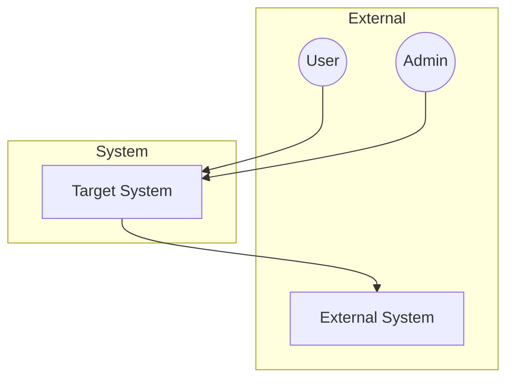
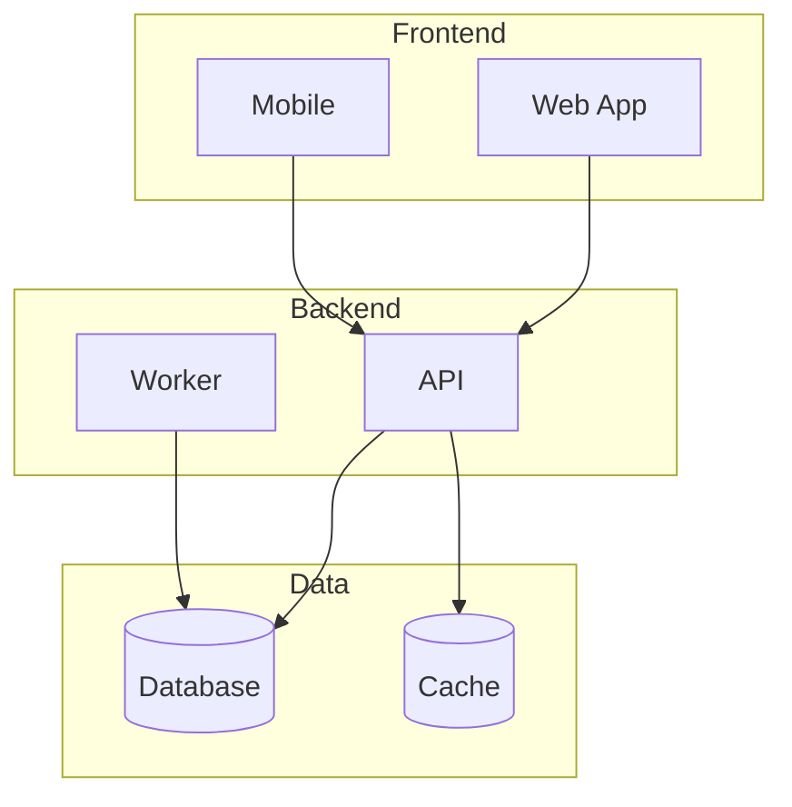
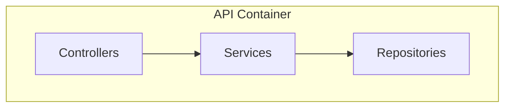
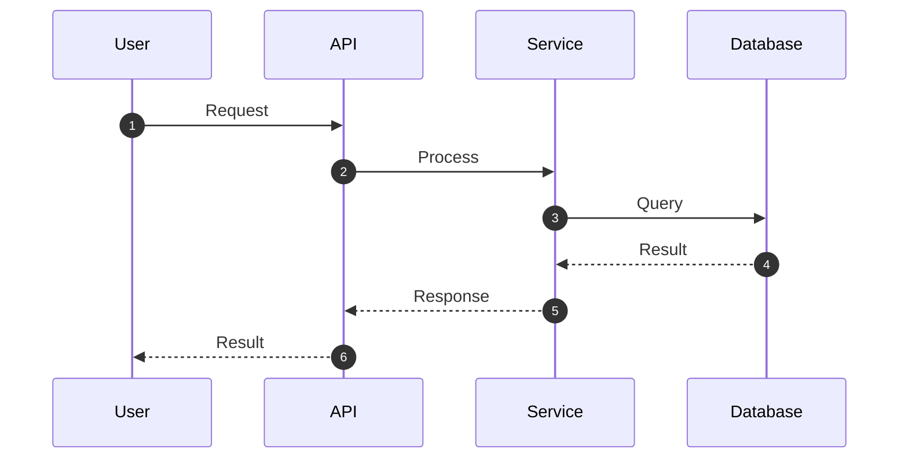
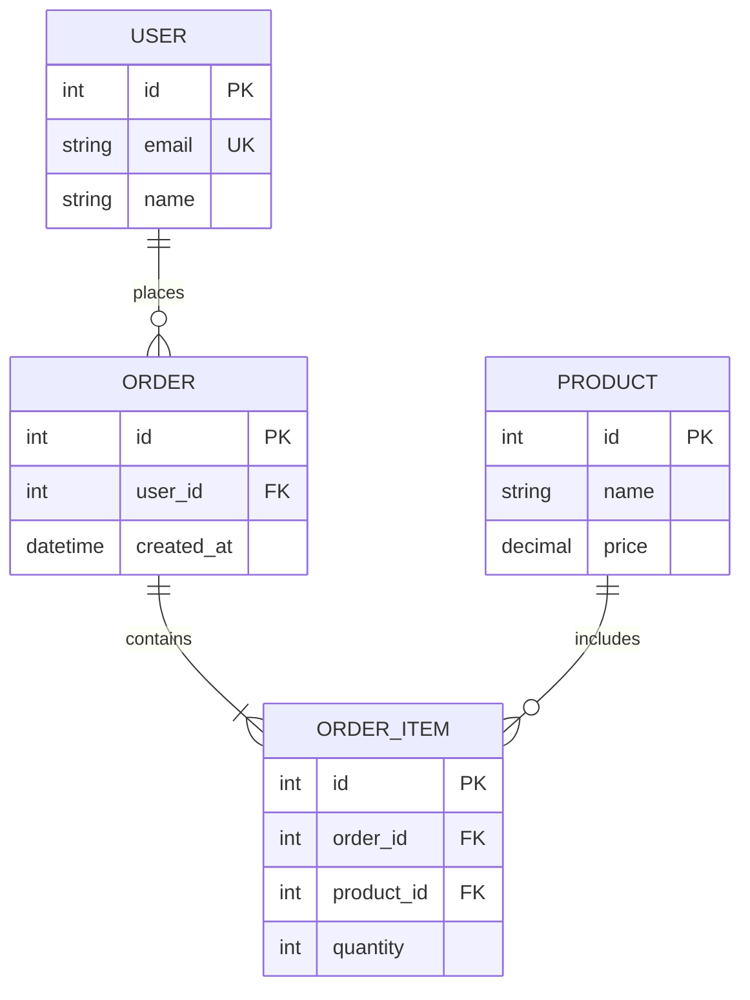
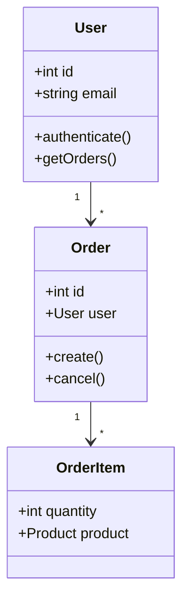
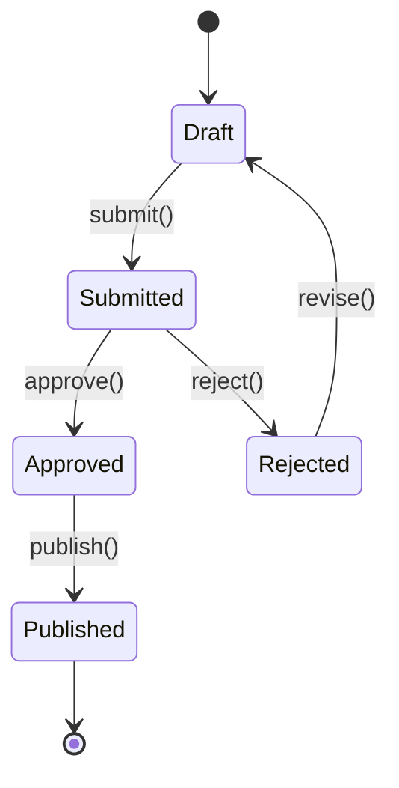
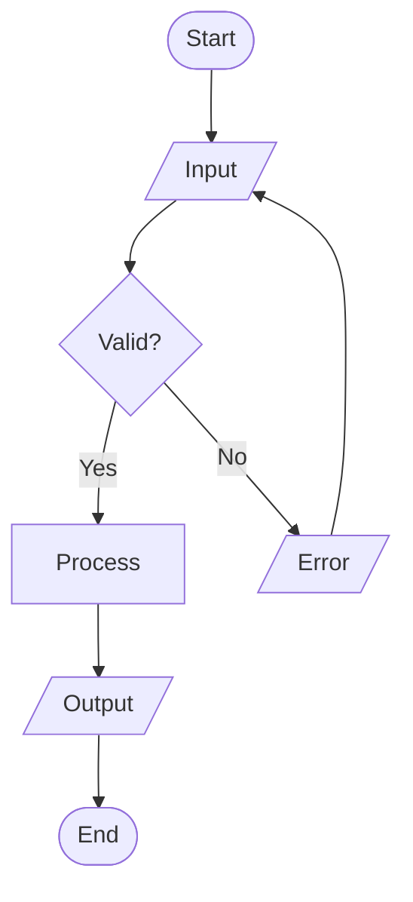
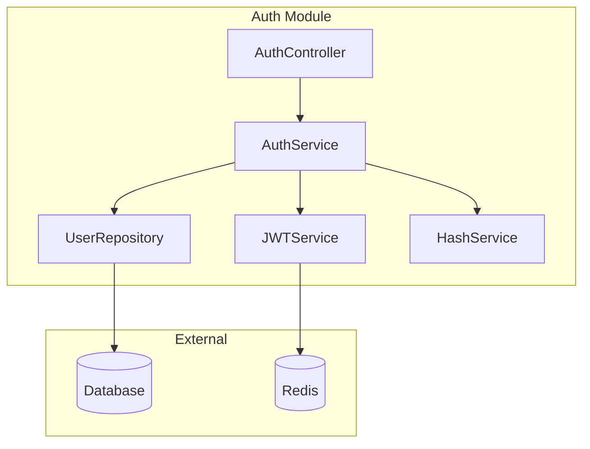
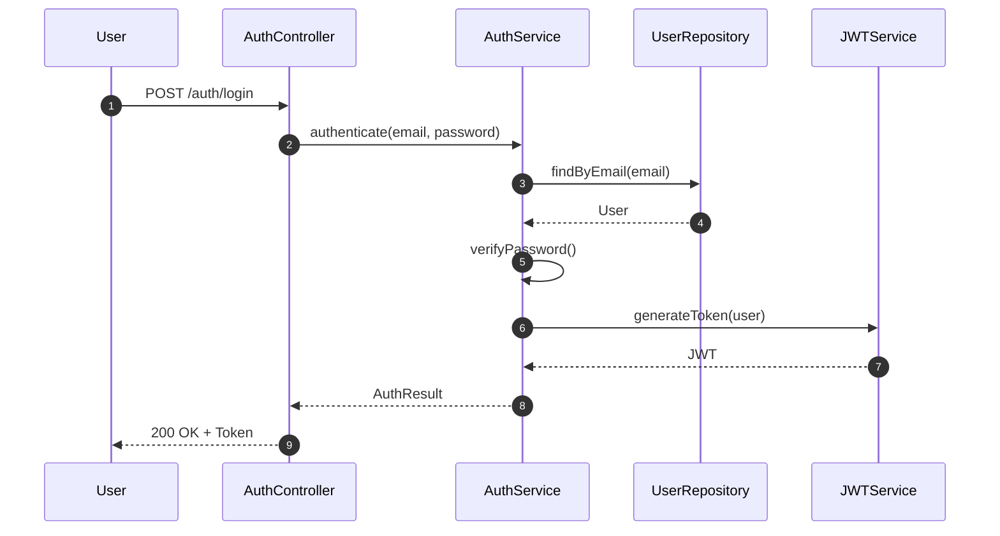

# Comando: /architect:diagram

Stai per generare diagrammi per: **$ARGUMENTS**

---

## FASE 1: Comprensione Richiesta

### 1.1 Identifica Target

```
Target: $ARGUMENTS

Determina:
- E' un componente specifico o l'intero sistema?
- Esiste gia' codice da analizzare?
- Quali tipi di diagramma sono appropriati?
```

### 1.2 Chiedi Tipo Diagramma (se non specificato)

Se il tipo non e' chiaro, usa AskUserQuestion:

```
Quale tipo di diagramma vuoi generare?

1. Architecture (C4 Context/Container/Component)
2. Sequence (flussi e interazioni)
3. Entity-Relationship (database schema)
4. Class (struttura OOP)
5. State (macchina a stati)
6. Flowchart (logica decisionale)
7. Tutti i rilevanti
```

---

## FASE 2: Raccolta Informazioni

### 2.1 Se Codebase Esistente

```
Task tool con subagent_type: architect:codebase-analyzer

Prompt:
"Analizza il componente/sistema: $ARGUMENTS

Estrai informazioni per generare diagrammi:

Per Architecture:
- Componenti principali
- Relazioni tra componenti
- Sistemi esterni

Per Sequence:
- Flussi principali
- Attori coinvolti
- Chiamate tra componenti

Per ER:
- Entita' database
- Relazioni
- Campi chiave

Per Class:
- Classi principali
- Ereditarieta'
- Associazioni

Per State:
- Stati possibili
- Transizioni
- Eventi trigger

Output: Dati strutturati per ogni tipo di diagramma."
```

### 2.2 Se Nuovo Sistema

Chiedi all'utente di descrivere:
- Componenti previsti
- Flussi principali
- Schema dati
- Stati (se applicabile)

---

## FASE 3: Generazione Diagrammi

### 3.1 Lancia Diagram Generator

```
Task tool con subagent_type: architect:diagram-generator

Prompt:
"Genera diagrammi per: $ARGUMENTS

Dati raccolti:
[output analisi o input utente]

Tipi richiesti: [tipi selezionati]

Per ogni diagramma:
1. Titolo descrittivo
2. Breve descrizione
3. Codice Mermaid
4. Legenda se necessario

Formati:
- Mermaid (principale)
- PlantUML (se richiesto)

Salva in .architect/diagrams/"
```

---

## FASE 4: Tipi di Diagramma

### 4.1 Architecture Diagrams (C4 Model)

**Context Diagram:**


**Container Diagram:**


**Component Diagram:**


### 4.2 Sequence Diagram



### 4.3 Entity-Relationship Diagram



### 4.4 Class Diagram



### 4.5 State Diagram



### 4.6 Flowchart



---

## FASE 5: Presentazione

### 5.1 Mostra Diagrammi

```markdown
## Diagrammi: [Nome Target]

**Generati il:** [YYYY-MM-DD HH:MM]
**Target:** $ARGUMENTS

---

### 1. [Tipo Diagramma 1]

**Descrizione:** [cosa rappresenta]

```mermaid
[codice]
```

**Note:** [eventuali note]

---

### 2. [Tipo Diagramma 2]

...

---

### File Salvati

I diagrammi sono stati salvati in:
- `.architect/diagrams/[target]_architecture.md`
- `.architect/diagrams/[target]_sequence.md`
- `.architect/diagrams/[target]_er.md`
- ...

### Come Visualizzare

1. **VS Code:** Installa estensione "Markdown Preview Mermaid Support"
2. **GitHub:** I diagrammi Mermaid sono renderizzati automaticamente
3. **Online:** Usa https://mermaid.live per edit interattivo
```

---

## REGOLE IMPORTANTI

1. **Analizza prima** - Non inventare, basa i diagrammi sul codice
2. **Sii accurato** - Nomi e relazioni devono essere corretti
3. **Mantieni semplice** - Max 15-20 elementi per diagramma
4. **Usa legenda** - Se usi simboli non standard
5. **Salva sempre** - In .architect/diagrams/

---

## GESTIONE CASI SPECIALI

### Componente non trovato

```
Non ho trovato il componente "$ARGUMENTS" nella codebase.

Opzioni:
1. Verifica il nome del componente
2. Specifica il path: /architect:diagram src/components/MyComponent
3. Descrivi il componente per generare un diagramma concettuale
```

### Diagramma troppo complesso

```
Il sistema ha troppi elementi per un singolo diagramma leggibile.

Suggerisco di dividere in:
1. Diagramma alto livello (overview)
2. Diagrammi dettagliati per sotto-componente

Vuoi procedere cosi'?
```

### Nessun pattern riconosciuto

```
Non ho identificato pattern chiari per un diagramma [tipo].

Il codice sembra:
- [osservazione 1]
- [osservazione 2]

Vuoi:
1. Generare comunque un diagramma best-effort
2. Specificare manualmente la struttura
3. Saltare questo tipo di diagramma
```

---

## ESEMPIO OUTPUT

```markdown
## Diagrammi: User Authentication Module

**Generati il:** 2024-01-15 14:30
**Target:** src/auth/

---

### 1. Component Diagram

**Descrizione:** Struttura interna del modulo di autenticazione



---

### 2. Sequence Diagram - Login Flow

**Descrizione:** Flusso di autenticazione utente



---

### File Salvati

- `.architect/diagrams/auth_component.md`
- `.architect/diagrams/auth_sequence_login.md`
```
