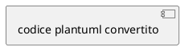
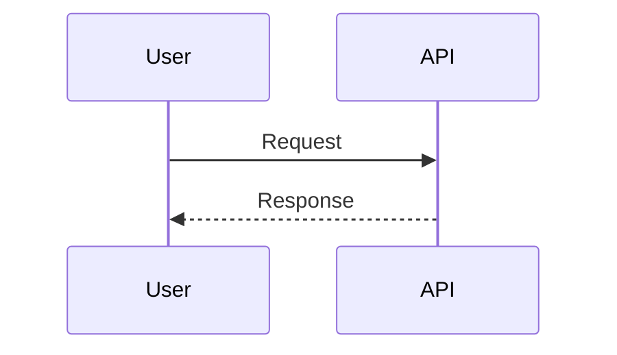
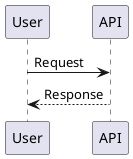

# Comando: /architect:export

Stai per esportare in formato: **$ARGUMENTS**

---

## FASE 1: Parsing Argomenti

### 1.1 Estrai Parametri

```
Input: $ARGUMENTS

Formato supportati:
- markdown (default) - Documento completo
- mermaid - Solo diagrammi Mermaid
- json - Struttura dati JSON
- plantuml - Diagrammi PlantUML

Esempi:
- /architect:export markdown
- /architect:export json .architect/plans/plan_latest.md
- /architect:export mermaid
- /architect:export plantuml .architect/diagrams/
```

### 1.2 Determina Source

**Se source non specificato:**
```
1. Cerca ultimo file in .architect/plans/
2. Se non trovato, cerca in .architect/
3. Se vuoto, chiedi all'utente
```

**Se source specificato:**
```
1. Verifica esistenza file/directory
2. Se directory, processa tutti i file .md
```

---

## FASE 2: Lettura Source

### 2.1 Leggi Contenuto

```
1. Read del file source
2. Parse del contenuto Markdown
3. Estrai sezioni:
   - Titolo
   - Descrizione
   - Diagrammi Mermaid
   - Task/Step
   - Tabelle
   - Code blocks
```

---

## FASE 3: Conversione

### 3.1 Export Markdown (Pulito)

Genera documento Markdown ottimizzato per condivisione:

```markdown
# [Titolo]

> Esportato il [data] da [source]

## Sommario

- [Sezione 1](#sezione-1)
- [Sezione 2](#sezione-2)

---

## Sezione 1

[contenuto pulito]

## Sezione 2

[contenuto pulito]

---

*Generato con Architect Plugin per Claude Code*
```

**Operazioni:**
- Rimuovi metadata interni
- Formatta tabelle consistentemente
- Normalizza heading levels
- Aggiungi TOC

### 3.2 Export Mermaid

Estrai solo i diagrammi Mermaid:

```markdown
# Diagrammi: [Titolo Source]

> Esportato il [data]

## 1. [Nome Diagramma 1]

```mermaid
[codice diagramma 1]
```

## 2. [Nome Diagramma 2]

```mermaid
[codice diagramma 2]
```

---

## Come Utilizzare

### Mermaid Live Editor
1. Vai su https://mermaid.live
2. Incolla il codice del diagramma
3. Esporta come PNG/SVG

### VS Code
1. Installa "Markdown Preview Mermaid Support"
2. Apri il file .md
3. Preview (Ctrl+Shift+V)

### Documentazione
Mermaid e' supportato nativamente su:
- GitHub
- GitLab
- Notion
- Confluence
```

### 3.3 Export JSON

Converti in struttura JSON:

```json
{
  "metadata": {
    "title": "[Titolo]",
    "source": "[path source]",
    "exported_at": "YYYY-MM-DDTHH:MM:SS",
    "version": "1.0"
  },
  "content": {
    "objective": "[obiettivo estratto]",
    "description": "[descrizione]",
    "sections": [
      {
        "id": "section-1",
        "title": "Sezione 1",
        "content": "[contenuto]",
        "subsections": []
      }
    ],
    "tasks": [
      {
        "id": 1,
        "title": "[titolo task]",
        "file": "[path file]",
        "lines": "[range linee]",
        "complexity": "[bassa/media/alta]",
        "depends_on": []
      }
    ],
    "diagrams": [
      {
        "id": "diagram-1",
        "type": "architecture|sequence|er|class|state|flow",
        "title": "[titolo]",
        "mermaid": "[codice mermaid]"
      }
    ],
    "risks": [
      {
        "description": "[rischio]",
        "probability": "alta|media|bassa",
        "impact": "alto|medio|basso",
        "mitigation": "[mitigazione]"
      }
    ]
  },
  "statistics": {
    "total_tasks": 10,
    "total_diagrams": 3,
    "total_risks": 2,
    "estimated_complexity": "media"
  }
}
```

### 3.4 Export PlantUML

Converti diagrammi Mermaid in PlantUML:

```markdown
# Diagrammi PlantUML: [Titolo]

> Convertiti da Mermaid il [data]

## 1. [Nome Diagramma 1]



## 2. [Nome Diagramma 2]


---

## Note sulla Conversione

Alcuni elementi potrebbero non avere equivalente diretto:
- [nota 1]
- [nota 2]

## Come Utilizzare

### PlantUML Online
1. Vai su https://www.plantuml.com/plantuml
2. Incolla il codice
3. Genera immagine

### VS Code
1. Installa "PlantUML"
2. Alt+D per preview
```

**Mappatura Mermaid -> PlantUML:**

| Mermaid | PlantUML |
|---------|----------|
| `graph TB` | `@startuml` + top-to-bottom |
| `graph LR` | `@startuml` + left-to-right |
| `sequenceDiagram` | `@startuml` sequence |
| `classDiagram` | `@startuml` class |
| `erDiagram` | `@startuml` ER (con skinparam) |
| `stateDiagram` | `@startuml` state |

---

## FASE 4: Salvataggio

### 4.1 Determina Output Path

```
Base: .architect/exports/

Naming:
- [source_name]_[format]_[YYYYMMDD_HHMMSS].[ext]

Estensioni:
- markdown -> .md
- mermaid -> .md
- json -> .json
- plantuml -> .puml o .md
```

### 4.2 Salva File

```
1. Crea directory exports/ se non esiste
2. Scrivi file con contenuto convertito
3. Conferma salvataggio
```

---

## FASE 5: Presentazione

### 5.1 Output Finale

```markdown
## Export Completato

**Source:** [path source]
**Formato:** [formato]
**Output:** [path output]

### Contenuto Esportato

- Sezioni: X
- Diagrammi: Y
- Task: Z
- Rischi: W

### File Generato

```
[preview prime 20 righe]
...
```

### Prossimi Passi

**Per Markdown:**
- Condividi su GitHub/GitLab
- Importa in Notion/Confluence

**Per Mermaid:**
- Usa https://mermaid.live per edit
- Esporta come immagini

**Per JSON:**
- Importa in tool di project management
- Usa per automazioni

**Per PlantUML:**
- Genera diagrammi con plantuml CLI
- Integra in documentazione LaTeX
```

---

## REGOLE IMPORTANTI

1. **Preserva informazioni** - Non perdere dati nella conversione
2. **Formatta bene** - Output deve essere leggibile
3. **Documenta limitazioni** - Se conversione non e' perfetta
4. **Salva sempre** - In .architect/exports/

---

## GESTIONE CASI SPECIALI

### Source vuoto

```
Non ho trovato file da esportare.

Opzioni:
1. Crea prima un piano con /architect:plan
2. Specifica un file: /architect:export json /path/to/file.md
```

### Formato non supportato

```
Formato "[formato]" non supportato.

Formati disponibili:
- markdown - Documento pulito
- mermaid - Solo diagrammi Mermaid
- json - Struttura dati JSON
- plantuml - Diagrammi PlantUML
```

### Conversione parziale

```
Alcuni elementi non sono stati convertiti:

- [elemento 1]: [motivo]
- [elemento 2]: [motivo]

Il resto del contenuto e' stato esportato correttamente.
```

---

## ESEMPI

### Export JSON

**Input:** `/architect:export json`

**Output:**
```json
{
  "metadata": {
    "title": "Piano Sistema Notifiche",
    "source": ".architect/plans/plan_20240115_143022.md",
    "exported_at": "2024-01-15T16:00:00",
    "version": "1.0"
  },
  "content": {
    "objective": "Implementare sistema notifiche push",
    "tasks": [
      {
        "id": 1,
        "title": "Creare modello DeviceToken",
        "file": "models/device.py",
        "complexity": "bassa",
        "depends_on": []
      },
      {
        "id": 2,
        "title": "Implementare NotificationService",
        "file": "services/notification.py",
        "complexity": "media",
        "depends_on": [1]
      }
    ],
    "diagrams": [
      {
        "id": "arch-1",
        "type": "architecture",
        "title": "Sistema Notifiche",
        "mermaid": "graph TB..."
      }
    ]
  },
  "statistics": {
    "total_tasks": 7,
    "total_diagrams": 2,
    "estimated_complexity": "media"
  }
}
```

### Export PlantUML

**Input:** `/architect:export plantuml`

**Mermaid originale:**


**PlantUML convertito:**

