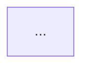

# Comando: /architect:init

Stai per inizializzare la Memory Bank per questo progetto.

---

## FASE 1: Verifica Esistenza

### 1.1 Controlla Directory

```bash
# Verifica se .architect/ esiste gia'
ls -la .architect/
```

Se esiste gia':
```
La Memory Bank esiste gia' in .architect/

Contenuto attuale:
[lista file esistenti]

Vuoi:
1. Aggiornare i file esistenti
2. Sovrascrivere tutto
3. Annullare

[usa AskUserQuestion per chiedere]
```

### 1.2 Crea Directory

Se non esiste, crea la struttura:

```bash
mkdir -p .architect/plans
mkdir -p .architect/diagrams
```

---

## FASE 2: Analisi Codebase

### 2.1 Lancia Analisi Completa

Usa `codebase-analyzer` per analisi approfondita:

```
Task tool con subagent_type: architect:codebase-analyzer

Prompt:
"Esegui un'analisi COMPLETA della codebase per inizializzare la Memory Bank.

Analizza e documenta:
1. Struttura completa del progetto
2. Stack tecnologico con versioni
3. Pattern architetturali usati
4. Design patterns identificati
5. Dipendenze interne ed esterne
6. Entry points principali
7. Technical debt esistente
8. Convenzioni di naming e stile
9. Configurazioni chiave
10. Test coverage e strategie

Output: Report completo per popolare Memory Bank."
```

---

## FASE 3: Generazione File Memory Bank

### 3.1 architecture.md

Crea il file principale di architettura:

```markdown
# Architecture Overview

> Auto-generato da /architect:init il [DATA]
> Ultima modifica: [DATA]

## Sistema

**Nome:** [nome progetto]
**Tipo:** [Web App / API / CLI / Library / etc.]
**Versione:** [se disponibile]

## Stack Tecnologico

| Layer | Tecnologia | Versione |
|-------|------------|----------|
| Linguaggio | ... | ... |
| Framework | ... | ... |
| Database | ... | ... |
| Cache | ... | ... |
| Queue | ... | ... |

## Architettura

[Diagramma C4 Context]



## Layer e Moduli

| Layer | Directory | Responsabilita' |
|-------|-----------|-----------------|
| Presentation | src/api/ | REST endpoints |
| Business | src/services/ | Business logic |
| Data | src/repositories/ | Data access |

## Flussi Principali

### [Flusso 1]
[Descrizione + sequence diagram]

### [Flusso 2]
[Descrizione + sequence diagram]

## Entry Points

| Entry Point | File | Descrizione |
|-------------|------|-------------|
| Main | ... | ... |

## Configurazioni

| Config | File | Ambiente |
|--------|------|----------|
| Database | config/db.py | .env |
| API Keys | config/secrets.py | .env |
```

### 3.2 dependencies.md

Crea il file delle dipendenze:

```markdown
# Dependencies Graph

> Auto-generato da /architect:init il [DATA]

## Dipendenze Esterne

| Package | Versione | Uso | Critico |
|---------|----------|-----|---------|
| ... | ... | ... | Si/No |

## Dipendenze Interne


## Moduli e Import

| Modulo | Importa da | Importato da |
|--------|------------|--------------|
| ... | ... | ... |

## Dipendenze Circolari

[Lista se presenti, altrimenti "Nessuna rilevata"]

## Aggiornamenti Consigliati

| Package | Attuale | Disponibile | Breaking |
|---------|---------|-------------|----------|
| ... | ... | ... | Si/No |
```

### 3.3 decisions.md

Crea il template per ADR:

```markdown
# Architecture Decision Records

> Documenta qui le decisioni architetturali importanti

## Template ADR

```
### ADR-XXX: [Titolo]

**Data:** YYYY-MM-DD
**Stato:** Proposed | Accepted | Deprecated | Superseded
**Decisori:** [chi ha preso la decisione]

#### Contesto
[Descrivi il contesto e il problema]

#### Decisione
[Descrivi la decisione presa]

#### Conseguenze
[Descrivi le conseguenze positive e negative]

#### Alternative Considerate
1. [Alternativa 1]: [perche' scartata]
2. [Alternativa 2]: [perche' scartata]
```

## ADR Esistenti

[Lista vuota inizialmente, verra' popolata]

---

### ADR-001: [Prima decisione identificata dall'analisi]

**Data:** [data init]
**Stato:** Accepted (storico)

#### Contesto
[Dedotto dall'analisi codebase]

#### Decisione
[Pattern/architettura rilevata]

#### Conseguenze
[Implicazioni identificate]
```

### 3.4 patterns.md

Crea il file dei pattern:

```markdown
# Patterns e Convenzioni

> Auto-generato da /architect:init il [DATA]

## Pattern Architetturali

### [Pattern Principale]

**Tipo:** [MVC / Clean Architecture / etc.]
**Implementazione:**
[descrizione di come e' implementato]


## Design Patterns

| Pattern | Dove | Esempio |
|---------|------|---------|
| Repository | src/repositories/ | UserRepository |
| Service | src/services/ | AuthService |
| Factory | src/factories/ | ... |

## Convenzioni

### Naming

| Elemento | Convenzione | Esempio |
|----------|-------------|---------|
| File | snake_case | user_service.py |
| Classe | PascalCase | UserService |
| Funzione | snake_case | get_user_by_id |
| Costante | UPPER_CASE | MAX_RETRIES |

### Struttura File

```
# Ordine tipico degli import
1. Standard library
2. Third-party
3. Local imports

# Ordine tipico delle classi
1. Constants
2. Class attributes
3. __init__
4. Public methods
5. Private methods
```

### Error Handling

[Pattern di gestione errori usato]

### Logging

[Convenzioni di logging]

### Testing

[Convenzioni di testing]
```

### 3.5 tech-debt.md

Crea il file del technical debt:

```markdown
# Technical Debt Register

> Auto-generato da /architect:init il [DATA]
> Aggiornare regolarmente durante lo sviluppo

## Sommario

| Severita' | Conteggio |
|-----------|-----------|
| Critico | X |
| Alto | X |
| Medio | X |
| Basso | X |

## Debiti Identificati

### TD-001: [Titolo]

**Severita':** Critico | Alto | Medio | Basso
**Categoria:** Code Quality | Architecture | Security | Performance | Testing
**Locazione:** `path/to/file.py:XX-YY`
**Identificato:** [DATA]

**Descrizione:**
[Descrizione del problema]

**Impatto:**
[Conseguenze se non risolto]

**Soluzione Proposta:**
[Come risolvere]

**Effort Stimato:** [Basso/Medio/Alto]

---

### TD-002: [Titolo]
...

## Priorita' di Risoluzione

1. **Immediate:** [lista TD critici]
2. **Prossimo Sprint:** [lista TD alti]
3. **Backlog:** [lista TD medi/bassi]

## Metriche

| Metrica | Valore | Target |
|---------|--------|--------|
| Test Coverage | X% | >80% |
| Duplicazione | X% | <5% |
| Complessita' Media | X | <10 |
```

---

## FASE 4: Finalizzazione

### 4.1 Genera Diagrammi

Lancia `diagram-generator` per creare diagrammi iniziali:

```
Task tool con subagent_type: architect:diagram-generator

Prompt:
"Genera i diagrammi iniziali per la Memory Bank:

1. architecture_overview.md - C4 Context + Container
2. dependencies_graph.md - Grafo dipendenze moduli
3. database_schema.md - ER diagram (se applicabile)

Basati sull'analisi codebase fornita.
Salva in .architect/diagrams/"
```

### 4.2 Crea .gitignore Entry

Suggerisci all'utente:

```
Vuoi aggiungere .architect/ al .gitignore?

Raccomandazione:
- NO se vuoi versionare la documentazione architetturale
- SI se contiene informazioni sensibili o temporanee

[usa AskUserQuestion]
```

### 4.3 Report Finale

Mostra riepilogo:

```markdown
## Memory Bank Inizializzata

**Directory:** .architect/

**File creati:**
- architecture.md - Overview architettura
- dependencies.md - Grafo dipendenze
- decisions.md - Template ADR
- patterns.md - Pattern e convenzioni
- tech-debt.md - Registro technical debt

**Diagrammi:**
- diagrams/architecture_overview.md
- diagrams/dependencies_graph.md
- diagrams/database_schema.md (se applicabile)

**Prossimi passi:**
1. Rivedi i file generati e correggi eventuali imprecisioni
2. Aggiungi ADR per decisioni importanti passate
3. Usa /architect:plan per nuove feature
4. Aggiorna tech-debt.md durante lo sviluppo

**Comandi utili:**
- /architect:plan <feature> - Pianifica nuova feature
- /architect:design <sistema> - Design completo
- /architect:diagram <componente> - Genera diagrammi
- /architect:review recent - Rivedi ultimo piano
```

---

## REGOLE IMPORTANTI

1. **Analisi completa** - Non saltare l'analisi codebase
2. **File strutturati** - Segui i template forniti
3. **Aggiornabili** - I file devono essere facili da mantenere
4. **No secrets** - Non includere credenziali o dati sensibili
5. **Versionabili** - Struttura compatibile con git

---

## GESTIONE ERRORI

| Errore | Azione |
|--------|--------|
| Directory gia' esiste | Chiedi se aggiornare o sovrascrivere |
| Codebase vuota | Crea struttura minima con placeholder |
| Analisi fallita | Riprova con scope ridotto |
| Permessi negati | Segnala e chiedi intervento utente |
