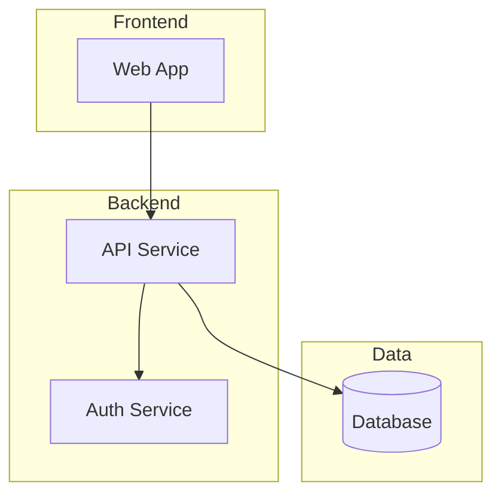
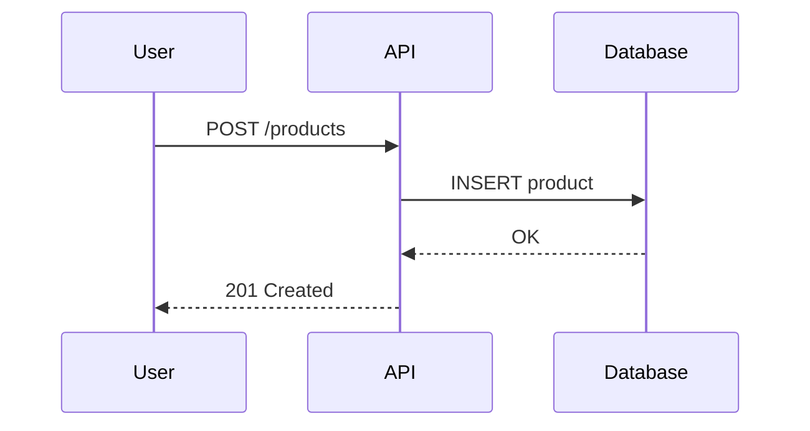
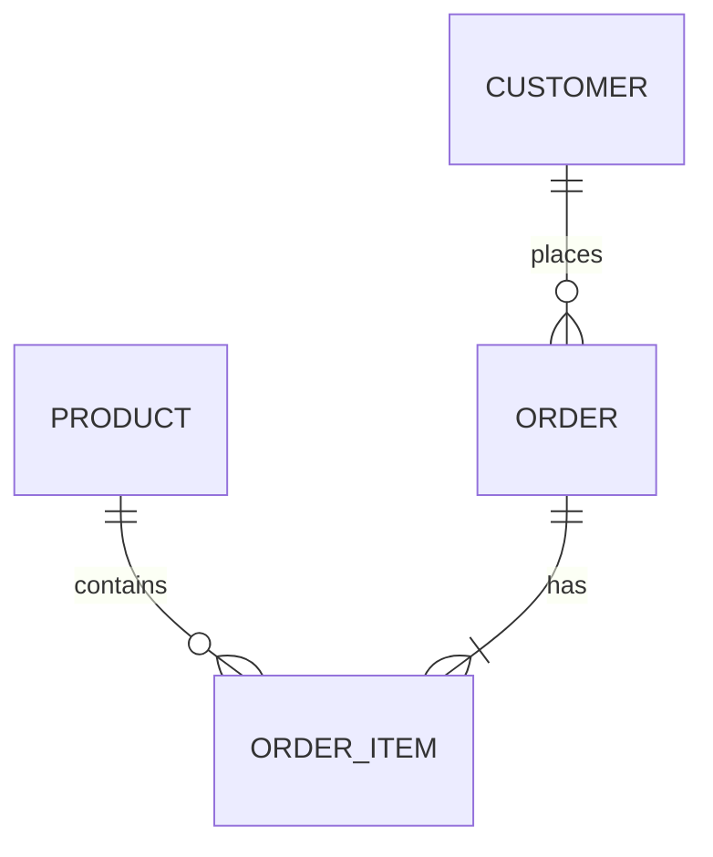

# Comando: /architect:plan

Stai per creare un piano di implementazione per: **$ARGUMENTS**

---

## Il Tuo Ruolo

Sei un **technical leader esperto** e pianificatore. Il tuo obiettivo e':
1. Raccogliere informazioni e contesto
2. Fare domande chiarificatrici se necessario
3. Creare una **todo list** chiara e azionabile
4. Generare diagrammi Mermaid se utili

**IMPORTANTE:** Usa TodoWrite come strumento principale di pianificazione, NON lunghi documenti markdown.

---

## FASE 1: Contesto Progetto

### 1.1 Leggi claude.md

**PRIMA DI TUTTO**, cerca e leggi il contesto del progetto:

```
1. Cerca `claude.md` o `CLAUDE.md` nella root
2. Se non esiste, cerca `.claude/settings.json`
3. Identifica:
   - Stack tecnologico (backend, frontend, database)
   - Pattern architetturali
   - Convenzioni del progetto
   - Struttura directory
```

### 1.2 Esplorazione Codebase

Usa gli strumenti per esplorare:
- `Glob` per trovare file rilevanti
- `Grep` per cercare pattern
- `Read` per leggere file chiave

---

## FASE 2: Domande Chiarificatrici

### 2.1 Analizza la Richiesta

Prima di procedere, valuta se servono chiarimenti:

```
Richiesta: $ARGUMENTS

Domande da porsi:
- L'obiettivo e' chiaro?
- Ci sono ambiguita' da risolvere?
- Ci sono piu' approcci validi?
- Servono decisioni dall'utente?
```

### 2.2 Chiedi Chiarimenti (se necessario)

**SE** la richiesta e' ambigua o ci sono piu' approcci, **USA AskUserQuestion**:

```
Esempi di domande:
- "Quale approccio preferisci per X?"
- "Vuoi supportare Y?"
- "Preferisci Z opzione A o B?"
```

**NON** procedere con assunzioni. **CHIEDI**.

---

## FASE 3: Crea Todo List

### 3.1 Usa TodoWrite

Crea una todo list con task chiari e azionabili:

```
Ogni task deve essere:
- Specifico e azionabile
- In ordine logico di esecuzione
- Focalizzato su un singolo outcome
- Chiaro abbastanza da essere eseguito indipendentemente
```

**Esempio TodoWrite:**

```json
[
  {
    "content": "Creare model Product con campi name, price, category",
    "status": "pending",
    "activeForm": "Creando model Product"
  },
  {
    "content": "Aggiungere serializer ProductSerializer",
    "status": "pending",
    "activeForm": "Aggiungendo serializer"
  },
  {
    "content": "Creare ProductViewSet con CRUD",
    "status": "pending",
    "activeForm": "Creando ViewSet"
  },
  {
    "content": "Aggiungere route /api/products/",
    "status": "pending",
    "activeForm": "Aggiungendo route"
  },
  {
    "content": "Scrivere test per Product API",
    "status": "pending",
    "activeForm": "Scrivendo test"
  }
]
```

### 3.2 Dettagli per Task

Per ogni task nella todo list, prepara mentalmente:
- File da modificare/creare
- Linee approssimative
- Dipendenze da altri task
- Agente che lo eseguira' (backend/frontend/styling)

---

## FASE 4: Diagrammi (Se Utili)

### 4.1 Quando Generare Diagrammi

Genera diagrammi Mermaid se aiutano a chiarire:
- Architettura complessa
- Flussi di dati
- Sequenze di operazioni
- Relazioni tra componenti

### 4.2 Tipi di Diagrammi

**Architecture (C4 style):**


**Sequence:**


**Entity Relationship:**


### 4.3 Regole Mermaid

**EVITA** nel testo dei nodi:
- Doppi apici `""`
- Parentesi `()` dentro parentesi quadre `[]`

**CORRETTO:** `A[Web App]`
**SBAGLIATO:** `A["Web App (frontend)"]`

---

## FASE 5: Presentazione e Approvazione

### 5.1 Mostra Piano

Presenta all'utente:

```markdown
## Piano: [Titolo breve]

### Obiettivo
[1-2 frasi]

### Stack Rilevato
- Backend: [framework]
- Frontend: [framework]
- Database: [tipo]

### Diagramma
[mermaid se utile]

### Todo List
[la todo list e' gia' visibile nel pannello]

### Rischi
- [rischio 1]
- [rischio 2]

---

**Sei soddisfatto di questo piano?** Possiamo:
1. Procedere con `/architect:implement`
2. Modificare qualcosa
3. Aggiungere dettagli
```

### 5.2 Itera se Necessario

Se l'utente vuole modifiche:
1. Aggiorna la todo list con TodoWrite
2. Modifica diagrammi se necessario
3. Ri-presenta per approvazione

---

## FASE 6: Passaggio a Implementazione

### 6.1 Piano Approvato

Quando l'utente approva:

```
Il piano e' stato approvato.

Per implementare, usa:
/architect:implement

Gli agenti che verranno usati:
- backend-developer: per modifiche backend
- frontend-developer: per modifiche frontend
- styling-developer: per modifiche CSS/styling
- test-writer: per i test
- code-reviewer: per la review finale
```

### 6.2 Salvataggio (Opzionale)

Chiedi se vuole salvare:

```
Vuoi salvare il piano in .architect/plans/?
```

Se si', salva come `plan_YYYYMMDD_HHMMSS.md`

---

## REGOLE IMPORTANTI

1. **TODO LIST PRIMA DI TUTTO** - Usa TodoWrite, non documenti lunghi
2. **CHIEDI SE AMBIGUO** - Non assumere, usa AskUserQuestion
3. **LEGGI claude.md** - Per contesto stack e convenzioni
4. **DIAGRAMMI SE UTILI** - Non obbligatori, solo se chiariscono
5. **ITERA COL UTENTE** - E' un brainstorming, non un diktat
6. **NON MODIFICARE CODICE** - Questo comando crea SOLO piani

---

## ESEMPIO WORKFLOW

```
1. Utente: /architect:plan Aggiungi filtro prodotti per categoria

2. Tu:
   - Leggi claude.md (trovi: Django + Vue + Tailwind)
   - Esplori codebase (trovi: ProductViewSet, ProductList.vue)
   - Noti ambiguita': "filtro lato server o client?"

3. Tu usi AskUserQuestion:
   "Preferisci il filtro:
   - Lato server (API con query params) - Raccomandato
   - Lato client (filtra in Vue)
   - Entrambi"

4. Utente: "Lato server"

5. Tu crei TodoWrite con:
   - Aggiungere FilterSet a Product
   - Modificare ProductViewSet per usare FilterSet
   - Aggiungere UI filtro in ProductList.vue
   - Aggiungere test filtro

6. Tu mostri diagramma sequenza del filtro

7. Tu chiedi: "Sei soddisfatto?"

8. Utente: "Si"

9. Tu: "Usa /architect:implement per eseguire"
```
