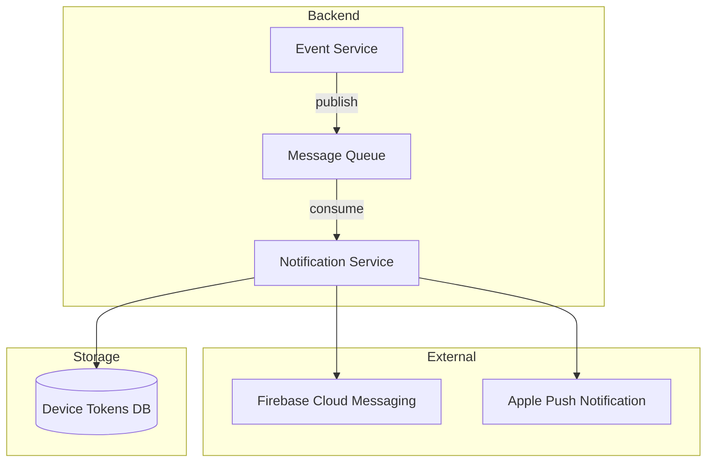

# Comando: /architect:plan

Stai per creare un piano di implementazione per: **$ARGUMENTS**

---

## FASE 1: Analisi Requisiti

### 1.1 Comprensione Richiesta

Prima di procedere, analizza la richiesta:

```
Richiesta: $ARGUMENTS

Domande da porsi:
- Qual e' l'obiettivo principale?
- Quali sono i vincoli impliciti?
- Quali componenti del sistema sono coinvolti?
- Ci sono ambiguita' da chiarire?
```

### 1.2 Chiarimenti (se necessario)

Se la richiesta e' ambigua, **FERMATI** e chiedi chiarimenti all'utente usando AskUserQuestion:
- Scope della modifica
- Priorita' (performance vs semplicita')
- Vincoli tecnici specifici
- Integrazioni richieste

---

## FASE 2: Analisi Codebase

### 2.1 Discovery

Lancia l'agente `codebase-analyzer` per analizzare il progetto:

```
Task tool con subagent_type: architect:codebase-analyzer

Prompt:
"Analizza la codebase per pianificare: $ARGUMENTS

Concentrati su:
1. File e moduli rilevanti per questa feature
2. Pattern architetturali esistenti da seguire
3. Dipendenze che potrebbero essere impattate
4. Convenzioni di naming e stile
5. Test esistenti correlati

Output: Report strutturato con file, pattern, dipendenze."
```

### 2.2 Attendi Risultati

Raccogli l'output dell'analisi prima di procedere.

---

## FASE 3: Pianificazione

### 3.1 Lancia Architect

Lancia l'agente principale `architect` per creare il piano:

```
Task tool con subagent_type: architect:architect

Prompt:
"Crea un piano di implementazione dettagliato per: $ARGUMENTS

Contesto dall'analisi codebase:
[inserisci output di codebase-analyzer]

Il piano deve includere:
1. Obiettivo chiaro
2. Architettura proposta con diagramma Mermaid
3. Task di implementazione con file e linee specifiche
4. Dipendenze tra task
5. Rischi e mitigazioni
6. Test necessari
7. Stima complessita'

Formato output: Piano strutturato in markdown."
```

### 3.2 Genera Diagrammi

Se il piano richiede visualizzazioni aggiuntive, lancia `diagram-generator`:

```
Task tool con subagent_type: architect:diagram-generator

Prompt:
"Genera diagrammi per il piano: $ARGUMENTS

Diagrammi richiesti:
- Architecture diagram (C4 container level)
- Sequence diagram per flussi principali
- ER diagram se coinvolge database

Salva in .architect/diagrams/"
```

---

## FASE 4: Review (Opzionale ma Raccomandato)

### 4.1 Valida Piano

Lancia `plan-reviewer` per validare il piano:

```
Task tool con subagent_type: architect:plan-reviewer

Prompt:
"Rivedi e valida questo piano di implementazione:

[inserisci piano generato]

Valuta:
1. Completezza (tutti i casi coperti?)
2. Fattibilita' (e' realistico?)
3. Rischi non identificati
4. Casi limite mancanti
5. Suggerimenti di miglioramento

Output: Score (1-10) e feedback dettagliato."
```

---

## FASE 5: Presentazione

### 5.1 Mostra Piano all'Utente

Presenta il piano finale all'utente con questo formato:

```markdown
## Piano di Implementazione: [Titolo]

### Obiettivo
[descrizione chiara]

### Architettura Proposta

```mermaid
[diagramma]
```

### Task di Implementazione

| # | Task | File | Complessita' | Dipende da |
|---|------|------|--------------|------------|
| 1 | ... | ... | ... | - |

### Dettaglio Task

#### Task #1: [Nome]
**File:** `path/file.ext`
**Modifiche:**
- ...

[ripeti per ogni task]

### Rischi

| Rischio | Mitigazione |
|---------|-------------|

### Test Richiesti
- ...

### Complessita' Totale: [Bassa/Media/Alta]

---

**Vuoi procedere con l'implementazione?**
Se si', puoi usare il piano con `/multi-agent-orchestrator:implement` o implementare manualmente.
```

### 5.2 Salvataggio

Chiedi all'utente se vuole salvare il piano:

```
Vuoi salvare questo piano in .architect/plans/?
- Si: salva come plan_YYYYMMDD_HHMMSS.md
- No: mostra solo a schermo
```

---

## REGOLE IMPORTANTI

1. **NON modificare codice** - Questo comando crea SOLO piani
2. **Analizza PRIMA di pianificare** - Usa codebase-analyzer
3. **Sii specifico** - File e linee esatte, non descrizioni vaghe
4. **Includi diagrammi** - Visualizzazioni aiutano la comprensione
5. **Identifica rischi** - Meglio prevederli che scoprirli dopo
6. **Chiedi se ambiguo** - Non assumere, chiedi chiarimenti

---

## ESEMPIO

**Input:** `/architect:plan Aggiungi sistema di notifiche push`

**Output atteso:**

```markdown
## Piano di Implementazione: Sistema Notifiche Push

### Obiettivo
Implementare un sistema di notifiche push per eventi utente (nuovi messaggi, ordini, promozioni).

### Architettura Proposta



### Task di Implementazione

| # | Task | File | Complessita' | Dipende da |
|---|------|------|--------------|------------|
| 1 | Creare modello DeviceToken | models/device.py | Bassa | - |
| 2 | Creare migration | migrations/xxx.py | Bassa | #1 |
| 3 | Implementare NotificationService | services/notification.py | Media | #1 |
| 4 | Integrare FCM SDK | services/push/fcm.py | Media | #3 |
| 5 | Integrare APNS | services/push/apns.py | Media | #3 |
| 6 | Creare API registrazione device | api/devices.py | Bassa | #1 |
| 7 | Aggiungere test | tests/test_notification.py | Media | #3,#4,#5 |

### Rischi

| Rischio | Mitigazione |
|---------|-------------|
| Rate limiting FCM | Implementare queue con retry |
| Token scaduti | Gestire errori e cleanup periodico |

### Complessita' Totale: Media
```
