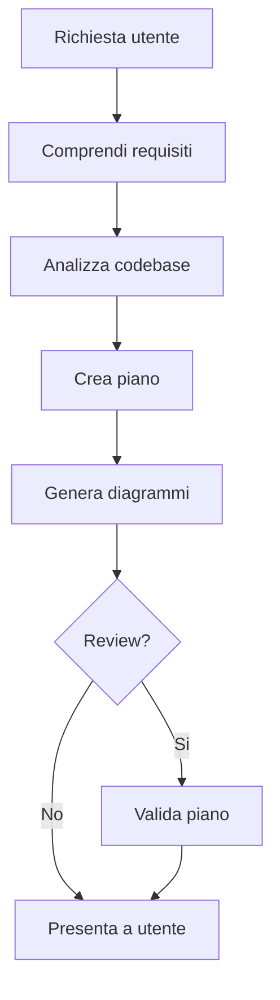
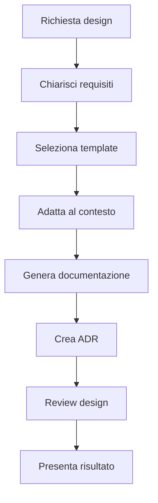

# Skill: Architecture Planning

## Quando Attivare

Questa skill si attiva quando l'utente chiede di:
- Pianificare una nuova feature
- Progettare un sistema
- Creare documentazione architetturale
- Generare diagrammi
- Analizzare codebase esistente
- Revisionare piani esistenti

**Trigger keywords:**
- "pianifica", "plan", "progetta", "design"
- "architettura", "architecture"
- "diagramma", "diagram"
- "documenta", "documentation"
- "ADR", "decision record"

---

## Principi di Pianificazione

### 1. Analisi Prima di Tutto

```
SEMPRE:
1. Comprendi i requisiti
2. Analizza il codice esistente
3. Identifica pattern e convenzioni
4. POI pianifica

MAI:
- Pianificare senza leggere il codice
- Assumere strutture non verificate
- Ignorare pattern esistenti
```

### 2. Pianificazione Incrementale

```
Per feature piccole (< 5 file):
1. Analisi rapida
2. Piano sintetico
3. Diagramma se necessario

Per feature medie (5-15 file):
1. Analisi approfondita
2. Piano dettagliato con task
3. Diagrammi architettura + sequenza
4. Review opzionale

Per feature grandi (> 15 file):
1. Analisi completa con codebase-analyzer
2. Design architetturale con architect
3. Diagrammi multipli
4. Review obbligatoria con plan-reviewer
5. ADR per decisioni chiave
```

### 3. Specificity over Generality

```
Invece di:
"Modifica il modulo utenti"

Scrivi:
"File: src/models/user.py, linee 45-60
Aggiungi campo 'email_verified: bool = False'
dopo il campo 'email' (linea 47)"
```

---

## Workflow Standard

### Per /architect:plan



### Per /architect:design



---

## Best Practices

### Analisi Codebase

1. **Usa MCP semantici se disponibili**
   - mcp__code-search prima di grep
   - Query precise per migliori risultati

2. **Mappa le dipendenze**
   - Import/export tra moduli
   - Dipendenze esterne
   - Accoppiamento tra componenti

3. **Identifica pattern esistenti**
   - Non reinventare, segui convenzioni
   - Documenta deviazioni se necessarie

### Creazione Piani

1. **Task atomici**
   - Una responsabilita' per task
   - File e linee specifiche
   - Output atteso chiaro

2. **Dipendenze esplicite**
   - Quali task dipendono da altri?
   - Ordine di esecuzione
   - Parallelizzabilita'

3. **Rischi documentati**
   - Cosa potrebbe andare storto?
   - Come mitigare?
   - Plan B?

### Diagrammi

1. **Usa il tipo giusto**
   - Architecture: overview sistema
   - Sequence: flussi temporali
   - ER: schema dati
   - Class: struttura OOP
   - State: macchine a stati

2. **Mantieni semplice**
   - Max 15-20 elementi
   - Dividi se troppo complesso
   - Legenda se necessario

3. **Naming chiaro**
   - Nomi descrittivi
   - Abbreviazioni spiegate
   - Consistenza

---

## Anti-Pattern da Evitare

### Nella Pianificazione

| Anti-Pattern | Problema | Soluzione |
|--------------|----------|-----------|
| Piano vago | Non implementabile | Specifica file, linee, codice |
| Over-engineering | Troppo complesso | YAGNI - solo quello che serve |
| Under-planning | Troppo semplice | Considera edge cases, errori |
| Ignora esistente | Inconsistenza | Analizza prima, adatta poi |

### Nei Diagrammi

| Anti-Pattern | Problema | Soluzione |
|--------------|----------|-----------|
| Troppi dettagli | Illeggibile | Dividi in livelli |
| Troppo astratto | Non utile | Aggiungi dettagli chiave |
| Nomi generici | Confusione | Nomi specifici e descrittivi |
| Senza contesto | Non comprensibile | Aggiungi descrizione |

---

## Checklist Pre-Output

### Per ogni Piano

- [ ] Obiettivo chiaro?
- [ ] Basato su analisi reale?
- [ ] Task specifici con file/linee?
- [ ] Dipendenze identificate?
- [ ] Rischi documentati?
- [ ] Test previsti?
- [ ] Diagrammi inclusi?

### Per ogni Design

- [ ] Requisiti chiariti?
- [ ] Template appropriato?
- [ ] Architettura documentata?
- [ ] ADR per decisioni?
- [ ] Review completata?

### Per ogni Diagramma

- [ ] Tipo appropriato?
- [ ] Leggibile (< 20 elementi)?
- [ ] Nomi chiari?
- [ ] Descrizione inclusa?
- [ ] Salvato in .architect/?

---

## Gestione Errori

| Situazione | Azione |
|------------|--------|
| Requisiti ambigui | Chiedi chiarimenti con AskUserQuestion |
| Codebase non trovata | Chiedi path o procedi come nuovo progetto |
| Pattern sconosciuto | Documenta e chiedi conferma |
| Piano troppo grande | Dividi in fasi incrementali |
| Review negativa | Incorpora feedback, itera |

---

## Integrazione con Altri Plugin

### Con multi-agent-orchestrator

Dopo aver creato un piano con `/architect:plan`, l'utente puo':
1. Approvare il piano
2. Usare il piano come input per `/multi-agent-orchestrator:implement`
3. Gli agenti esecutori seguiranno il piano

### Export per Altri Tool

Usa `/architect:export json` per generare formato compatibile con:
- Tool di project management
- CI/CD pipelines
- Automazioni custom

---

## Note Finali

L'architettura e' un investimento:
- Un buon piano riduce bug e rework
- La documentazione aiuta il team futuro
- I diagrammi comunicano meglio delle parole
- Le decisioni documentate (ADR) prevengono discussioni ripetute

Prenditi il tempo necessario per fare le cose bene.
