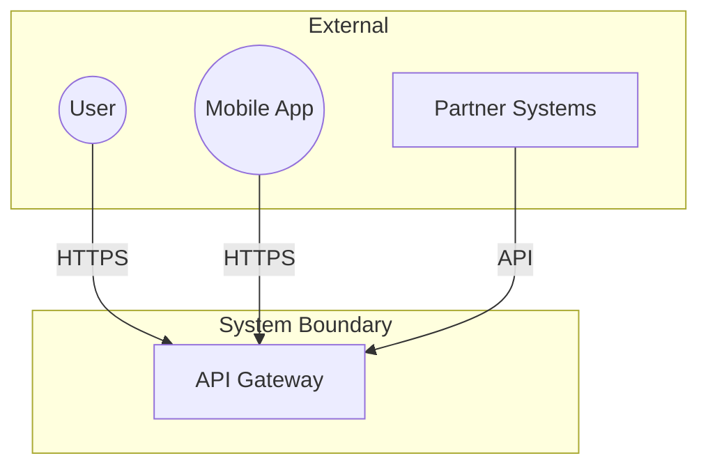
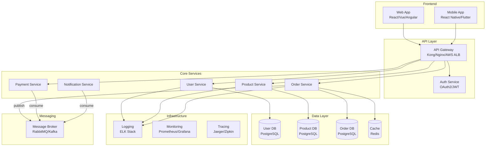
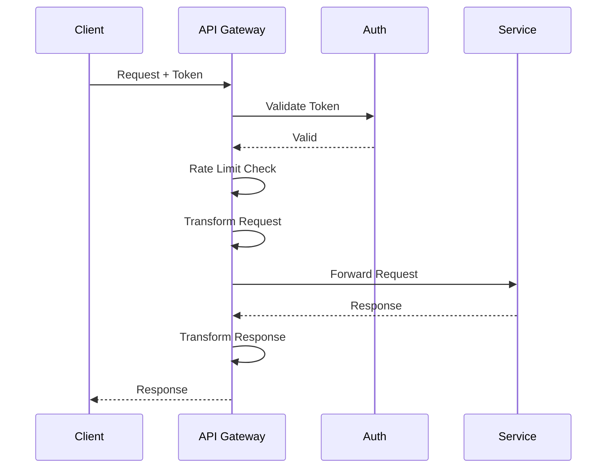
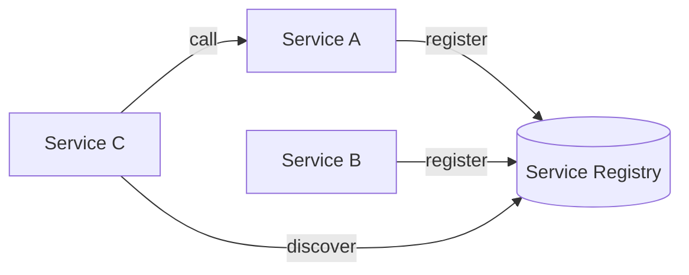
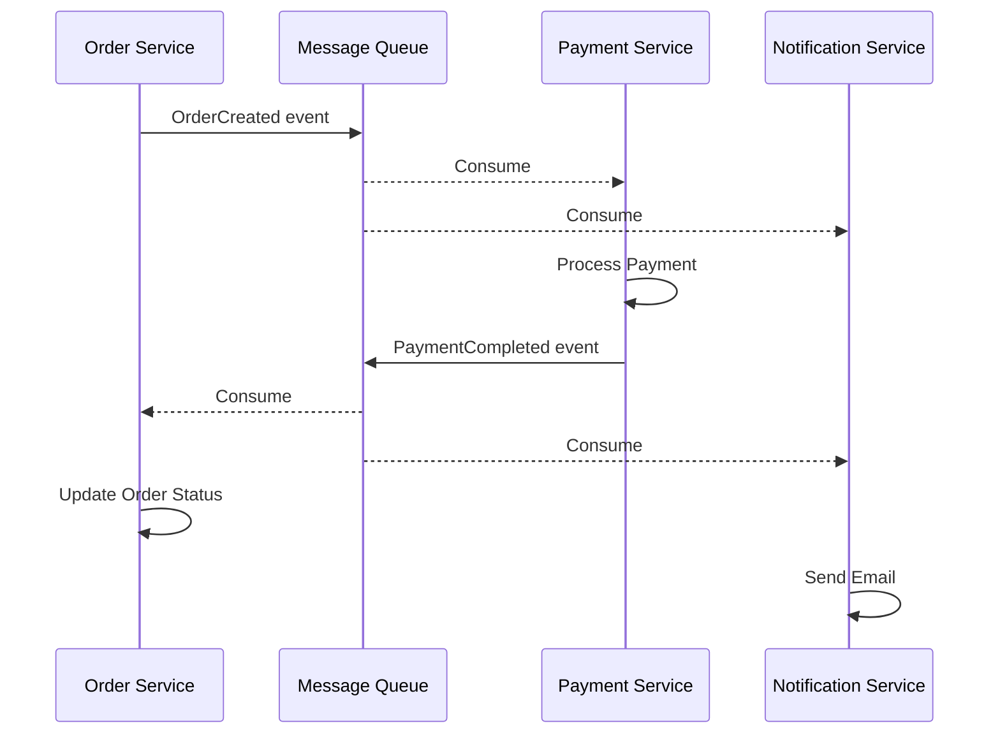
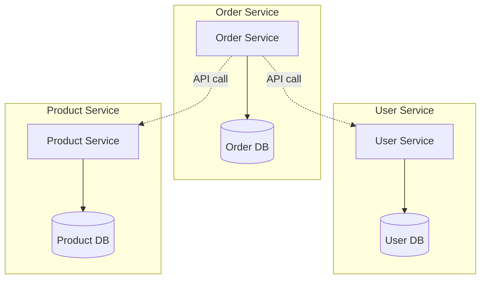
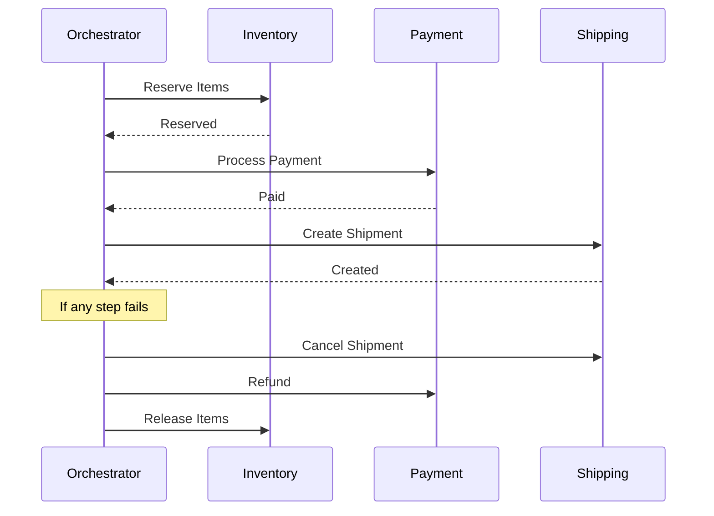
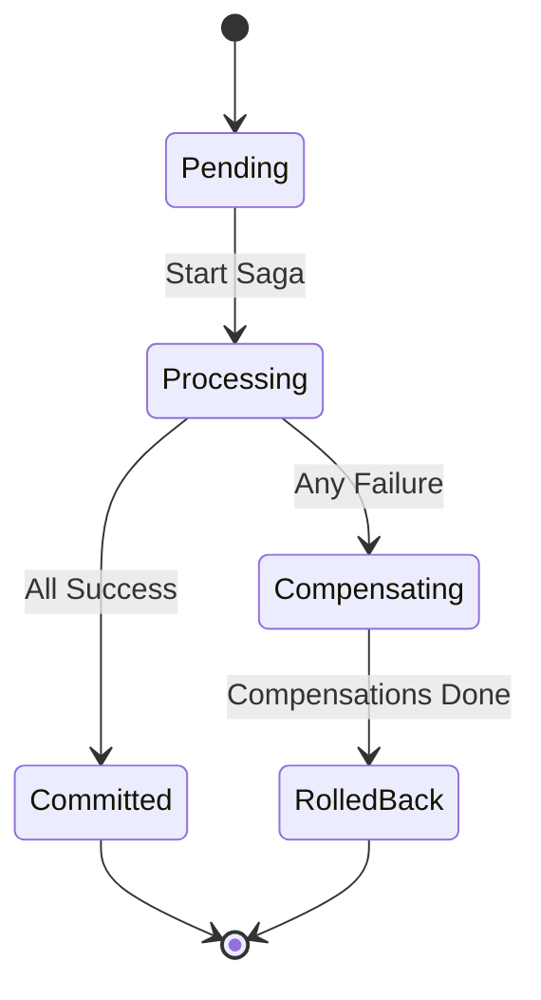
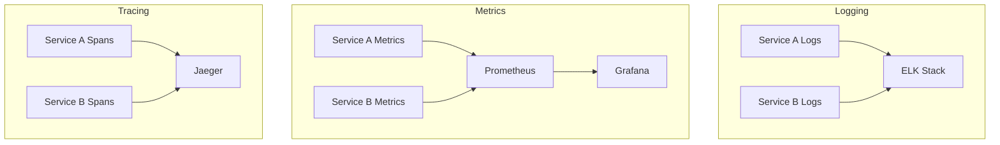
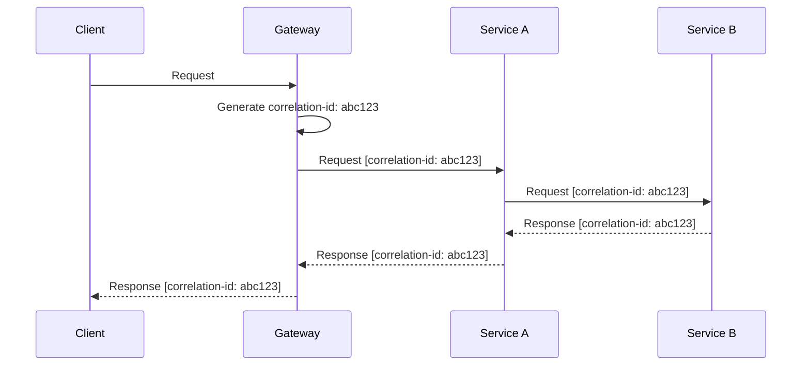

# Template: Architettura Microservizi

## Overview

Architettura distribuita basata su servizi indipendenti, ognuno con la propria responsabilita', database e ciclo di deployment.

---

## Quando Usare

**Ideale per:**
- Team grandi (5+ sviluppatori)
- Necessita' di scaling indipendente
- Deployment frequenti e indipendenti
- Diversi linguaggi/tecnologie per servizio
- Alta disponibilita' richiesta

**Evitare se:**
- Team piccolo (< 5 sviluppatori)
- MVP o prototipo
- Budget limitato per infrastruttura
- Dominio semplice senza confini chiari

---

## Architettura di Riferimento

### C4 Context Diagram



### C4 Container Diagram



---

## Struttura Directory

### Monorepo

```
project/
├── services/
│   ├── user-service/
│   │   ├── src/
│   │   ├── tests/
│   │   ├── Dockerfile
│   │   └── package.json
│   ├── product-service/
│   │   ├── src/
│   │   ├── tests/
│   │   ├── Dockerfile
│   │   └── package.json
│   ├── order-service/
│   │   └── ...
│   └── payment-service/
│       └── ...
├── shared/
│   ├── proto/              # gRPC definitions
│   ├── schemas/            # JSON schemas
│   └── utils/              # Shared utilities
├── infrastructure/
│   ├── docker-compose.yml
│   ├── kubernetes/
│   │   ├── base/
│   │   └── overlays/
│   └── terraform/
├── gateway/
│   └── kong.yml
└── docs/
    ├── architecture/
    └── api/
```

### Multi-Repo

```
organization/
├── user-service/           # Repo separato
├── product-service/        # Repo separato
├── order-service/          # Repo separato
├── shared-libs/            # Librerie condivise
└── infrastructure/         # IaC
```

---

## Pattern Chiave

### 1. API Gateway



**Responsabilita':**
- Authentication/Authorization
- Rate limiting
- Request/Response transformation
- Load balancing
- Circuit breaking
- Logging/Monitoring

### 2. Service Discovery



**Opzioni:**
- Consul
- Eureka
- Kubernetes DNS
- AWS Cloud Map

### 3. Event-Driven Communication



### 4. Database per Service



### 5. Saga Pattern (Distributed Transactions)



---

## Comunicazione tra Servizi

### Sincrona (HTTP/gRPC)

| Metodo | Quando | Pro | Contro |
|--------|--------|-----|--------|
| REST | CRUD, query semplici | Semplice, universale | Latenza, coupling |
| gRPC | Alta performance, streaming | Veloce, type-safe | Complessita' |
| GraphQL | Aggregazione, flessibilita' | Flessibile | Overhead |

### Asincrona (Events/Messages)

| Pattern | Quando | Pro | Contro |
|---------|--------|-----|--------|
| Pub/Sub | Notifiche, broadcast | Decoupling | Eventual consistency |
| Queue | Task processing | Retry, ordering | Complessita' |
| Event Sourcing | Audit, replay | Tracciabilita' | Storage |

---

## Data Management

### Strategie

| Strategia | Descrizione | Quando |
|-----------|-------------|--------|
| Database per Service | Ogni servizio ha il suo DB | Default |
| Shared Database | Servizi condividono DB | Legacy migration |
| CQRS | Separazione read/write | Alta scalabilita' read |
| Event Sourcing | Eventi come source of truth | Audit required |

### Gestione Transazioni Distribuite



---

## Observability

### Three Pillars



### Correlation ID



---

## Deployment

### Kubernetes

```yaml
# Service deployment example
apiVersion: apps/v1
kind: Deployment
metadata:
  name: user-service
spec:
  replicas: 3
  selector:
    matchLabels:
      app: user-service
  template:
    metadata:
      labels:
        app: user-service
    spec:
      containers:
      - name: user-service
        image: myregistry/user-service:v1.0.0
        ports:
        - containerPort: 8080
        resources:
          requests:
            memory: "256Mi"
            cpu: "250m"
          limits:
            memory: "512Mi"
            cpu: "500m"
        livenessProbe:
          httpGet:
            path: /health
            port: 8080
        readinessProbe:
          httpGet:
            path: /ready
            port: 8080
```

---

## Checklist Implementazione

### Infrastruttura
- [ ] Container orchestration (Kubernetes)
- [ ] Service mesh (Istio/Linkerd) - opzionale
- [ ] API Gateway configurato
- [ ] Message broker setup
- [ ] Centralized logging
- [ ] Distributed tracing
- [ ] Metrics collection

### Per Servizio
- [ ] Dockerfile ottimizzato
- [ ] Health endpoints (/health, /ready)
- [ ] Graceful shutdown
- [ ] Configuration via env vars
- [ ] Correlation ID propagation
- [ ] Circuit breaker
- [ ] Retry with backoff
- [ ] Rate limiting

### Data
- [ ] Database isolato per servizio
- [ ] Migration strategy
- [ ] Backup/restore plan
- [ ] Data consistency strategy

### Security
- [ ] Service-to-service auth (mTLS)
- [ ] Secrets management
- [ ] Network policies
- [ ] API authentication

---

## Trade-offs

| Aspetto | Pro | Contro |
|---------|-----|--------|
| Scalabilita' | Scaling indipendente | Complessita' operativa |
| Deployment | Deploy indipendenti | CI/CD complesso |
| Team | Team autonomi | Coordinamento difficile |
| Tecnologia | Liberta' di scelta | Skill diverse richieste |
| Resilienza | Failure isolation | Gestione failure distribuiti |
| Testing | Unit test semplici | Integration test complessi |
