# Template: Monolith Modulare

## Overview

Architettura monolitica strutturata in moduli ben definiti, con separazione netta delle responsabilita' e confini chiari tra componenti.

---

## Quando Usare

**Ideale per:**
- Team piccoli-medi (2-10 sviluppatori)
- MVP e startup in fase iniziale
- Domini con confini non ancora chiari
- Budget limitato per infrastruttura
- Time-to-market veloce

**Evitare se:**
- Team molto grande (20+ sviluppatori)
- Necessita' di scaling estremo e indipendente
- Requisiti di deployment continuo multi-team
- Tecnologie diverse per componente

---

## Architettura di Riferimento

### C4 Context Diagram

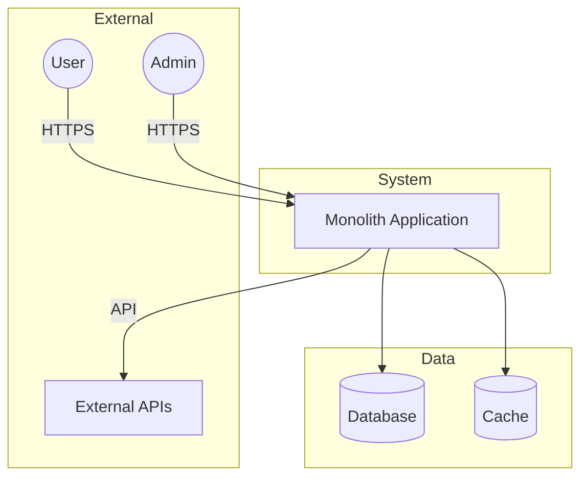

### C4 Container Diagram

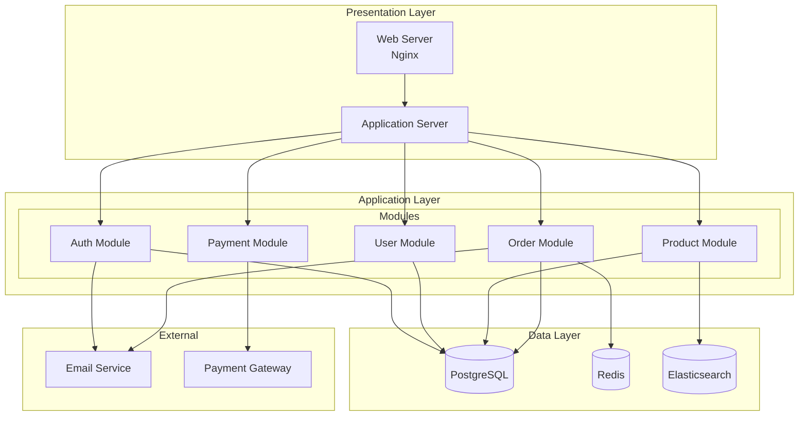

---

## Struttura Directory

### Clean Architecture

```
project/
├── src/
│   ├── domain/                 # Enterprise Business Rules
│   │   ├── entities/
│   │   │   ├── user.py
│   │   │   ├── product.py
│   │   │   └── order.py
│   │   ├── value_objects/
│   │   │   ├── email.py
│   │   │   └── money.py
│   │   └── exceptions/
│   │       └── domain_exceptions.py
│   │
│   ├── application/            # Application Business Rules
│   │   ├── use_cases/
│   │   │   ├── user/
│   │   │   │   ├── create_user.py
│   │   │   │   └── get_user.py
│   │   │   ├── product/
│   │   │   └── order/
│   │   ├── interfaces/         # Ports
│   │   │   ├── repositories/
│   │   │   │   ├── user_repository.py
│   │   │   │   └── product_repository.py
│   │   │   └── services/
│   │   │       ├── email_service.py
│   │   │       └── payment_service.py
│   │   └── dto/
│   │       ├── user_dto.py
│   │       └── order_dto.py
│   │
│   ├── infrastructure/         # Frameworks & Drivers
│   │   ├── persistence/
│   │   │   ├── repositories/
│   │   │   │   ├── sqlalchemy_user_repo.py
│   │   │   │   └── sqlalchemy_product_repo.py
│   │   │   ├── models/
│   │   │   │   ├── user_model.py
│   │   │   │   └── product_model.py
│   │   │   └── migrations/
│   │   ├── external/
│   │   │   ├── email/
│   │   │   │   └── smtp_email_service.py
│   │   │   └── payment/
│   │   │       └── stripe_payment_service.py
│   │   ├── cache/
│   │   │   └── redis_cache.py
│   │   └── config/
│   │       ├── settings.py
│   │       └── dependencies.py
│   │
│   └── presentation/           # Interface Adapters
│       ├── api/
│       │   ├── v1/
│       │   │   ├── routes/
│       │   │   │   ├── user_routes.py
│       │   │   │   └── product_routes.py
│       │   │   └── schemas/
│       │   │       ├── user_schemas.py
│       │   │       └── product_schemas.py
│       │   └── middleware/
│       │       ├── auth_middleware.py
│       │       └── error_handler.py
│       ├── cli/
│       │   └── commands/
│       └── web/
│           ├── templates/
│           └── static/
│
├── tests/
│   ├── unit/
│   │   ├── domain/
│   │   ├── application/
│   │   └── infrastructure/
│   ├── integration/
│   └── e2e/
│
├── docs/
├── scripts/
├── docker-compose.yml
├── Dockerfile
└── pyproject.toml
```

### Modular Monolith (Feature-based)

```
project/
├── src/
│   ├── core/                   # Shared kernel
│   │   ├── database.py
│   │   ├── security.py
│   │   ├── events.py
│   │   └── exceptions.py
│   │
│   ├── modules/
│   │   ├── auth/              # Auth module
│   │   │   ├── __init__.py
│   │   │   ├── domain/
│   │   │   ├── application/
│   │   │   ├── infrastructure/
│   │   │   └── api/
│   │   │
│   │   ├── users/             # Users module
│   │   │   ├── __init__.py
│   │   │   ├── domain/
│   │   │   ├── application/
│   │   │   ├── infrastructure/
│   │   │   └── api/
│   │   │
│   │   ├── products/          # Products module
│   │   │   └── ...
│   │   │
│   │   └── orders/            # Orders module
│   │       └── ...
│   │
│   ├── shared/                # Shared utilities
│   │   ├── utils/
│   │   └── types/
│   │
│   └── main.py                # Application entry point
│
├── tests/
│   └── modules/
│       ├── auth/
│       ├── users/
│       ├── products/
│       └── orders/
│
└── ...
```

---

## Pattern Chiave

### 1. Dependency Injection

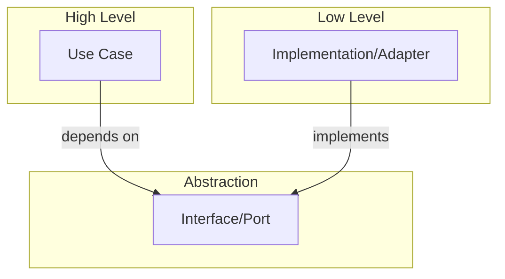

**Esempio Python:**
```python
# application/interfaces/repositories/user_repository.py
from abc import ABC, abstractmethod

class UserRepository(ABC):
    @abstractmethod
    def find_by_id(self, user_id: int) -> User | None:
        pass

    @abstractmethod
    def save(self, user: User) -> User:
        pass

# infrastructure/persistence/repositories/sqlalchemy_user_repo.py
class SQLAlchemyUserRepository(UserRepository):
    def __init__(self, session: Session):
        self._session = session

    def find_by_id(self, user_id: int) -> User | None:
        model = self._session.query(UserModel).get(user_id)
        return self._to_entity(model) if model else None
```

### 2. Use Case Pattern

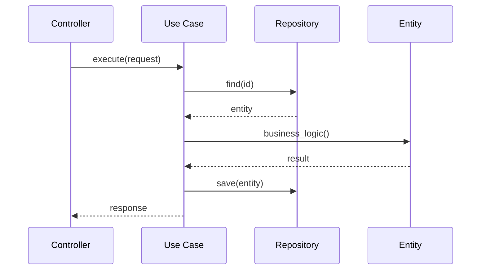

### 3. Repository Pattern

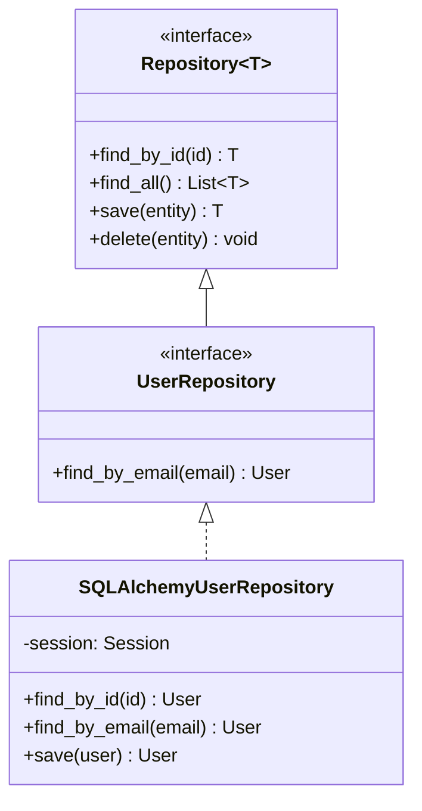

### 4. Domain Events

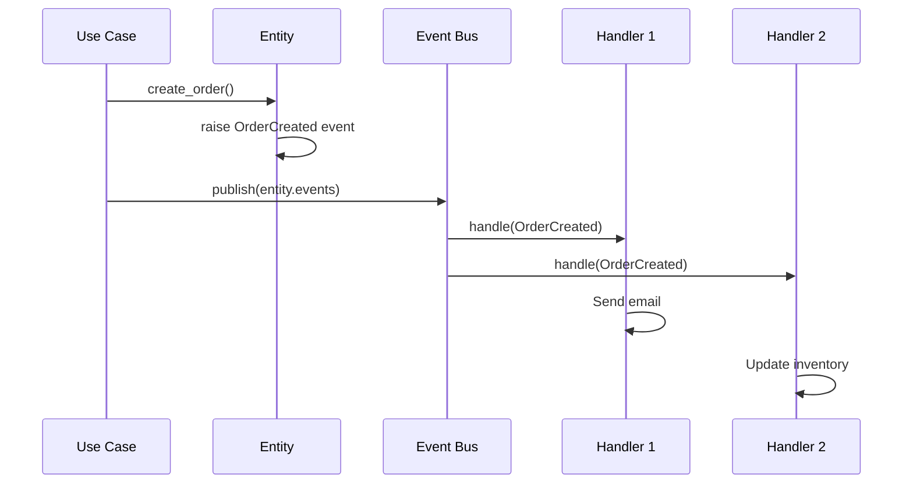

---

## Layer Rules

### Dependency Rule (Clean Architecture)

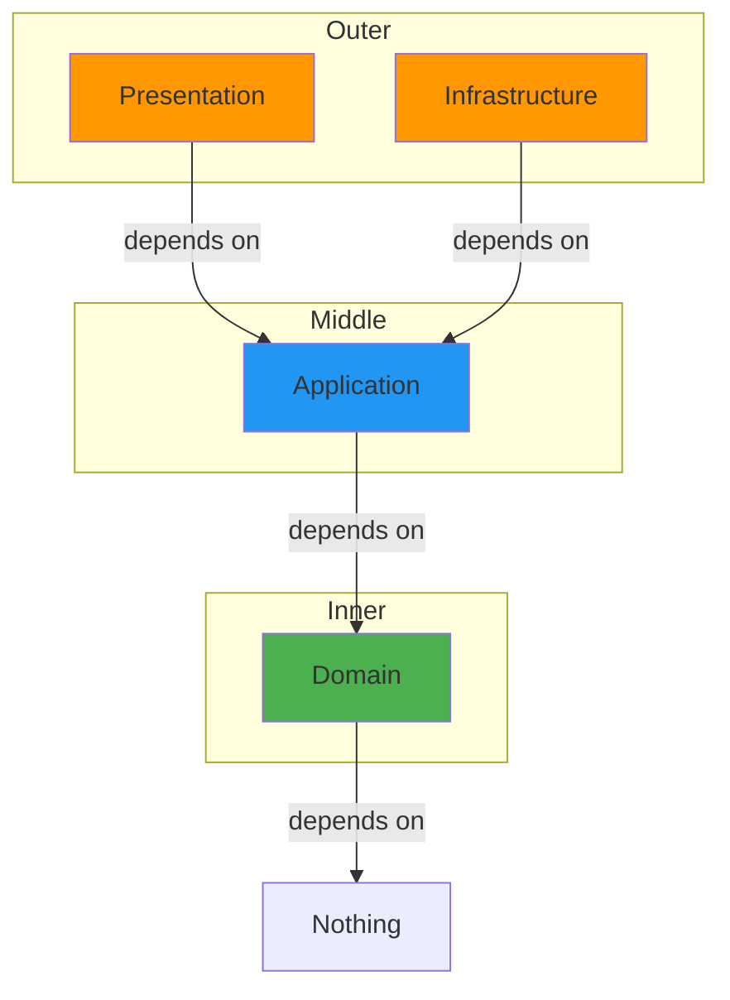

**Regole:**
1. **Domain** - Nessuna dipendenza esterna
2. **Application** - Dipende solo da Domain
3. **Infrastructure** - Implementa interfacce di Application
4. **Presentation** - Usa Application, non conosce Infrastructure

---

## Moduli e Comunicazione

### Comunicazione tra Moduli

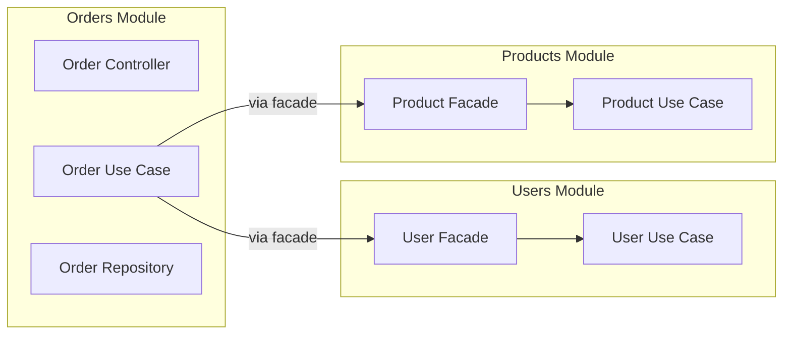

**Pattern Facade per comunicazione:**
```python
# modules/users/facade.py
class UserFacade:
    def __init__(self, get_user_use_case: GetUserUseCase):
        self._get_user = get_user_use_case

    def get_user_info(self, user_id: int) -> UserDTO:
        return self._get_user.execute(user_id)

# modules/orders/application/use_cases/create_order.py
class CreateOrderUseCase:
    def __init__(
        self,
        order_repo: OrderRepository,
        user_facade: UserFacade,  # Not direct dependency
        product_facade: ProductFacade
    ):
        ...
```

### Anti-Corruption Layer

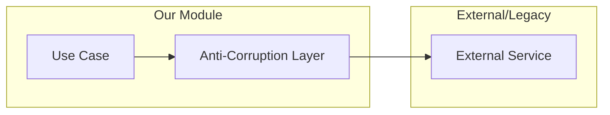

---

## Database Strategy

### Single Database, Separate Schemas

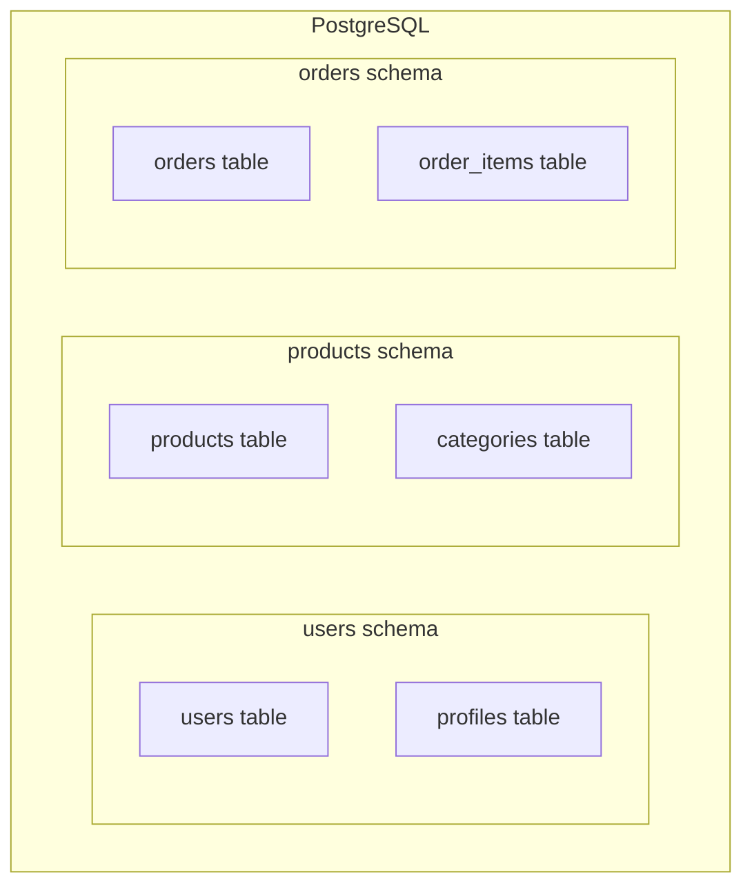

### Migrations Strategy

```
migrations/
├── versions/
│   ├── 001_initial_users.py
│   ├── 002_initial_products.py
│   ├── 003_initial_orders.py
│   ├── 004_add_user_preferences.py
│   └── ...
└── alembic.ini
```

---

## Testing Strategy

### Test Pyramid

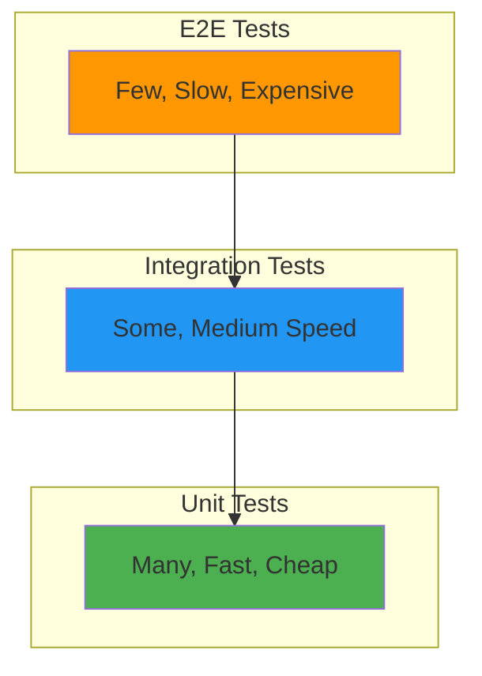

### Test per Layer

| Layer | Tipo Test | Mock |
|-------|-----------|------|
| Domain | Unit | Nessuno |
| Application | Unit | Repository, Services |
| Infrastructure | Integration | Database reale (testcontainers) |
| Presentation | Integration | Application layer |
| E2E | E2E | Nessuno |

---

## Scalability Path

### Vertical Scaling

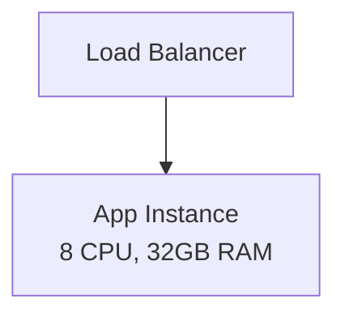

### Horizontal Scaling

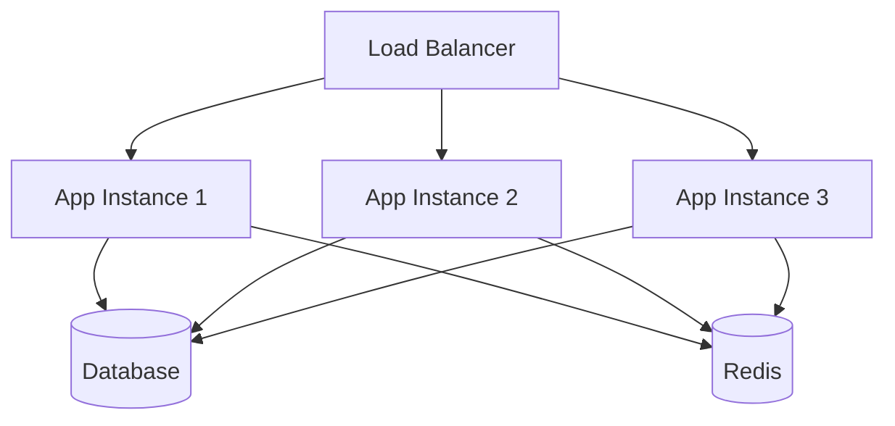

### Toward Microservices

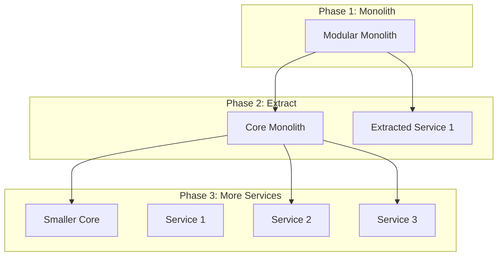

---

## Checklist Implementazione

### Struttura
- [ ] Layer separati (Domain, Application, Infrastructure, Presentation)
- [ ] Moduli con confini chiari
- [ ] Dependency injection configurata
- [ ] Interfacce per dipendenze esterne

### Domain
- [ ] Entities con business logic
- [ ] Value Objects per tipi complessi
- [ ] Domain Events definiti
- [ ] Nessuna dipendenza esterna

### Application
- [ ] Use Cases per ogni operazione
- [ ] DTOs per input/output
- [ ] Repository interfaces
- [ ] Service interfaces

### Infrastructure
- [ ] Repository implementations
- [ ] External service adapters
- [ ] Database configuration
- [ ] Cache configuration

### Presentation
- [ ] API routes organizzate
- [ ] Validation schemas
- [ ] Error handling middleware
- [ ] Authentication/Authorization

### Testing
- [ ] Unit tests per Domain
- [ ] Unit tests per Application (with mocks)
- [ ] Integration tests per Infrastructure
- [ ] E2E tests per flussi critici

---

## Trade-offs

| Aspetto | Pro | Contro |
|---------|-----|--------|
| Semplicita' | Facile da capire e deployare | Puo' diventare complesso |
| Performance | Chiamate in-process | Scaling limitato |
| Sviluppo | Refactoring facile | Rischio coupling |
| Deploy | Un solo artifact | Downtime per update |
| Testing | Integration test semplici | E2E puo' essere lento |
| Team | Codebase condivisa | Conflitti su merge |
