# Template: Architettura MVC

## Overview

Model-View-Controller (MVC) e' un pattern architetturale che separa l'applicazione in tre componenti principali: Model (dati e business logic), View (presentazione), Controller (gestione input e coordinamento).

---

## Quando Usare

**Ideale per:**
- Web application tradizionali
- CRUD-heavy applications
- Team con esperienza MVC
- Progetti con UI server-rendered
- Applicazioni con form complessi
- Admin panels e backoffice

**Evitare se:**
- Single Page Application (preferire API + Frontend)
- Applicazioni real-time intensive
- Microservizi (troppo monolitico)
- API-only backend (overkill)

---

## Architettura di Riferimento

### Pattern MVC Classico

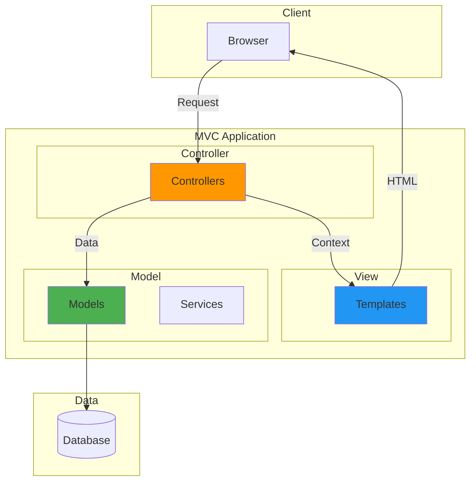

### Flusso Request/Response

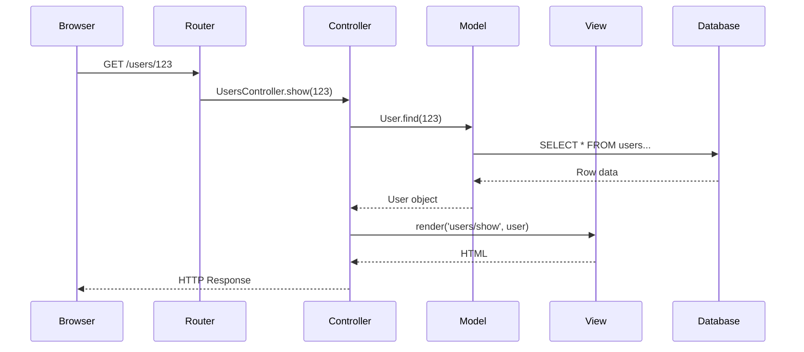

---

## Struttura Directory

### Django (Python)

```
project/
├── config/                     # Project configuration
│   ├── __init__.py
│   ├── settings/
│   │   ├── base.py
│   │   ├── development.py
│   │   └── production.py
│   ├── urls.py
│   ├── wsgi.py
│   └── asgi.py
│
├── apps/
│   ├── users/                  # Users app
│   │   ├── __init__.py
│   │   ├── admin.py           # Admin config
│   │   ├── apps.py
│   │   ├── models.py          # Model
│   │   ├── views.py           # Controller (Views in Django)
│   │   ├── forms.py           # Form handling
│   │   ├── urls.py            # URL routing
│   │   ├── serializers.py     # API serialization
│   │   ├── templates/         # View templates
│   │   │   └── users/
│   │   │       ├── list.html
│   │   │       ├── detail.html
│   │   │       └── form.html
│   │   ├── static/
│   │   │   └── users/
│   │   │       ├── css/
│   │   │       └── js/
│   │   └── tests/
│   │       ├── test_models.py
│   │       ├── test_views.py
│   │       └── test_forms.py
│   │
│   ├── products/
│   │   └── ...
│   │
│   └── orders/
│       └── ...
│
├── templates/                  # Global templates
│   ├── base.html
│   ├── includes/
│   │   ├── header.html
│   │   ├── footer.html
│   │   └── navbar.html
│   └── errors/
│       ├── 404.html
│       └── 500.html
│
├── static/                     # Global static files
│   ├── css/
│   ├── js/
│   └── images/
│
├── media/                      # User uploads
│
├── requirements/
│   ├── base.txt
│   ├── development.txt
│   └── production.txt
│
├── manage.py
├── Dockerfile
└── docker-compose.yml
```

### Ruby on Rails

```
project/
├── app/
│   ├── controllers/
│   │   ├── application_controller.rb
│   │   ├── users_controller.rb
│   │   └── products_controller.rb
│   ├── models/
│   │   ├── application_record.rb
│   │   ├── user.rb
│   │   └── product.rb
│   ├── views/
│   │   ├── layouts/
│   │   │   └── application.html.erb
│   │   ├── users/
│   │   │   ├── index.html.erb
│   │   │   ├── show.html.erb
│   │   │   └── _form.html.erb
│   │   └── products/
│   ├── helpers/
│   ├── mailers/
│   └── jobs/
│
├── config/
│   ├── routes.rb
│   ├── database.yml
│   └── environments/
│
├── db/
│   ├── migrate/
│   ├── seeds.rb
│   └── schema.rb
│
├── public/
├── test/
└── Gemfile
```

### Laravel (PHP)

```
project/
├── app/
│   ├── Http/
│   │   ├── Controllers/
│   │   │   ├── Controller.php
│   │   │   ├── UserController.php
│   │   │   └── ProductController.php
│   │   ├── Middleware/
│   │   └── Requests/
│   ├── Models/
│   │   ├── User.php
│   │   └── Product.php
│   └── Services/
│
├── resources/
│   ├── views/
│   │   ├── layouts/
│   │   │   └── app.blade.php
│   │   └── users/
│   │       ├── index.blade.php
│   │       └── show.blade.php
│   ├── css/
│   └── js/
│
├── routes/
│   ├── web.php
│   └── api.php
│
├── database/
│   └── migrations/
│
├── config/
├── public/
└── composer.json
```

### Express.js (Node.js)

```
project/
├── src/
│   ├── controllers/
│   │   ├── userController.js
│   │   └── productController.js
│   ├── models/
│   │   ├── User.js
│   │   └── Product.js
│   ├── views/
│   │   ├── layouts/
│   │   │   └── main.ejs
│   │   └── users/
│   │       ├── index.ejs
│   │       └── show.ejs
│   ├── routes/
│   │   ├── index.js
│   │   └── users.js
│   ├── middleware/
│   │   └── auth.js
│   └── app.js
│
├── public/
│   ├── css/
│   └── js/
│
├── config/
├── tests/
└── package.json
```

---

## Pattern Chiave

### 1. Model (Data & Business Logic)

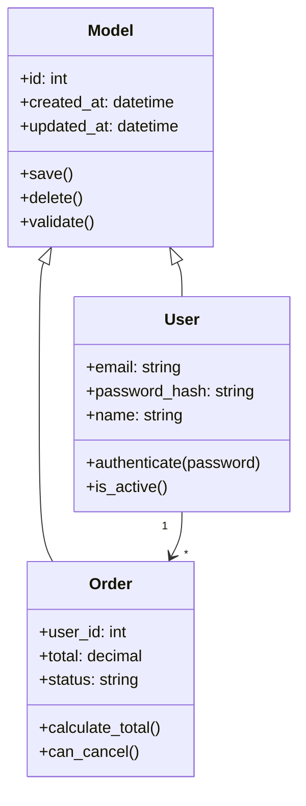

**Responsabilita':**
- Definizione struttura dati
- Validazioni
- Relazioni tra entita'
- Business logic del dominio
- Query e persistenza

**Esempio Django:**
```python
from django.db import models
from django.contrib.auth.hashers import make_password, check_password

class User(models.Model):
    email = models.EmailField(unique=True)
    password_hash = models.CharField(max_length=128)
    name = models.CharField(max_length=100)
    is_active = models.BooleanField(default=True)
    created_at = models.DateTimeField(auto_now_add=True)

    def set_password(self, password):
        self.password_hash = make_password(password)

    def check_password(self, password):
        return check_password(password, self.password_hash)

    class Meta:
        db_table = 'users'
```

### 2. View (Presentation)

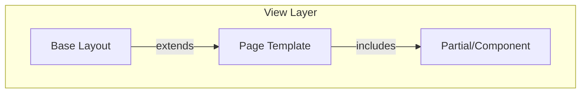

**Responsabilita':**
- Rendering HTML
- Presentazione dati
- Template inheritance
- Form rendering
- Asset inclusion

**Esempio Django Template:**
```html



<div class="user-profile">
    <h1>{{ user.name }}</h1>
    <p>Email: {{ user.email }}</p>

    <h2>Orders</h2>
    
        
    
        <p>No orders yet.</p>
    
</div>

```

### 3. Controller (Request Handling)

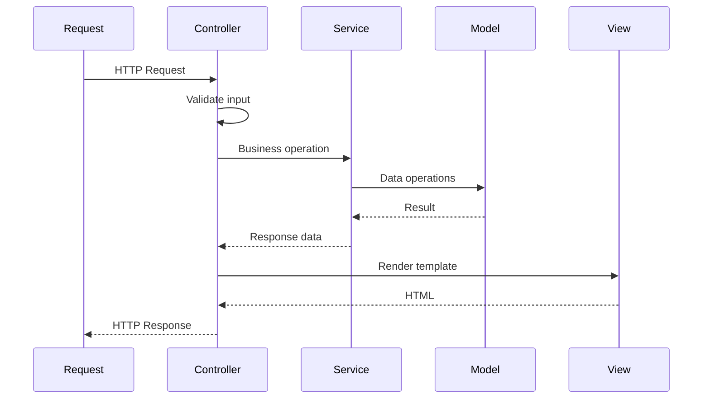

**Responsabilita':**
- Gestione route/URL
- Validazione input
- Chiamata a services/models
- Selezione view
- Gestione sessione
- Redirect e response

**Esempio Django View:**
```python
from django.shortcuts import render, get_object_or_404, redirect
from django.contrib import messages
from .models import User
from .forms import UserForm

class UserController:

    def index(request):
        """GET /users/"""
        users = User.objects.filter(is_active=True)
        return render(request, 'users/index.html', {'users': users})

    def show(request, id):
        """GET /users/{id}/"""
        user = get_object_or_404(User, id=id)
        return render(request, 'users/show.html', {'user': user})

    def create(request):
        """GET/POST /users/new/"""
        if request.method == 'POST':
            form = UserForm(request.POST)
            if form.is_valid():
                user = form.save()
                messages.success(request, 'User created successfully')
                return redirect('users:show', id=user.id)
        else:
            form = UserForm()

        return render(request, 'users/form.html', {'form': form})

    def update(request, id):
        """GET/POST /users/{id}/edit/"""
        user = get_object_or_404(User, id=id)

        if request.method == 'POST':
            form = UserForm(request.POST, instance=user)
            if form.is_valid():
                form.save()
                messages.success(request, 'User updated')
                return redirect('users:show', id=user.id)
        else:
            form = UserForm(instance=user)

        return render(request, 'users/form.html', {'form': form, 'user': user})

    def delete(request, id):
        """POST /users/{id}/delete/"""
        user = get_object_or_404(User, id=id)
        user.delete()
        messages.success(request, 'User deleted')
        return redirect('users:index')
```

---

## Varianti MVC

### MVP (Model-View-Presenter)

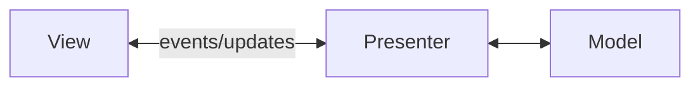

- View e' passiva (solo display)
- Presenter contiene la logica di presentazione
- Usato in GUI desktop, Android

### MVVM (Model-View-ViewModel)

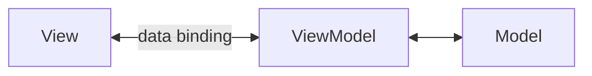

- Two-way data binding
- ViewModel espone observable properties
- Usato in WPF, Angular, Vue

### MVC + Service Layer

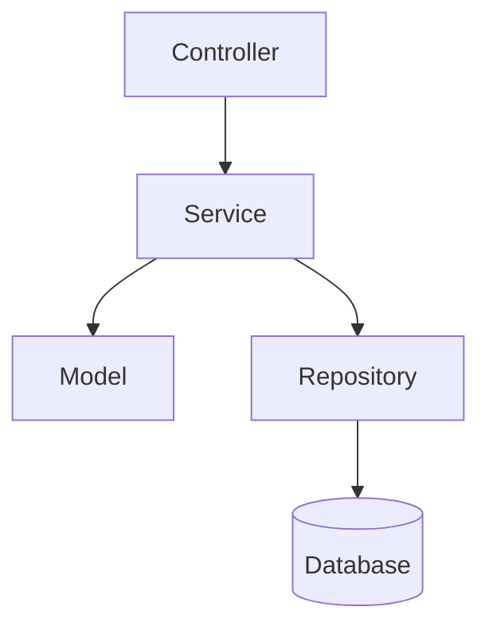

- Service contiene business logic complessa
- Repository astrae accesso dati
- Controller rimane snello

---

## Routing

### RESTful Routes

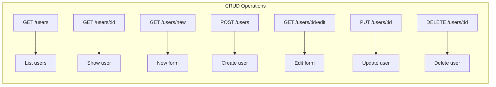

**Django urls.py:**
```python
from django.urls import path
from . import views

app_name = 'users'

urlpatterns = [
    path('', views.index, name='index'),
    path('<int:id>/', views.show, name='show'),
    path('new/', views.create, name='create'),
    path('<int:id>/edit/', views.update, name='update'),
    path('<int:id>/delete/', views.delete, name='delete'),
]
```

---

## Form Handling

### Form Flow

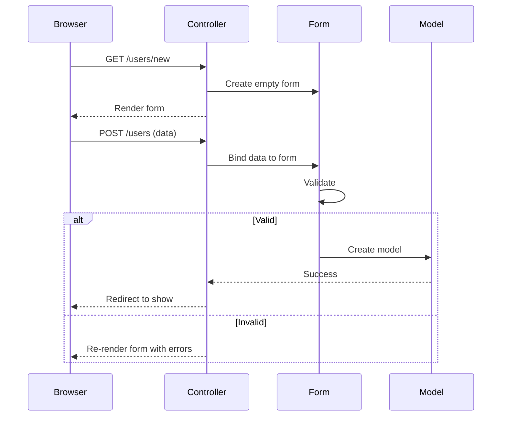

**Django Form:**
```python
from django import forms
from .models import User

class UserForm(forms.ModelForm):
    password = forms.CharField(widget=forms.PasswordInput)
    confirm_password = forms.CharField(widget=forms.PasswordInput)

    class Meta:
        model = User
        fields = ['email', 'name']

    def clean(self):
        cleaned_data = super().clean()
        password = cleaned_data.get('password')
        confirm = cleaned_data.get('confirm_password')

        if password and confirm and password != confirm:
            raise forms.ValidationError("Passwords don't match")

        return cleaned_data

    def save(self, commit=True):
        user = super().save(commit=False)
        user.set_password(self.cleaned_data['password'])
        if commit:
            user.save()
        return user
```

---

## Session & Authentication

### Session Flow

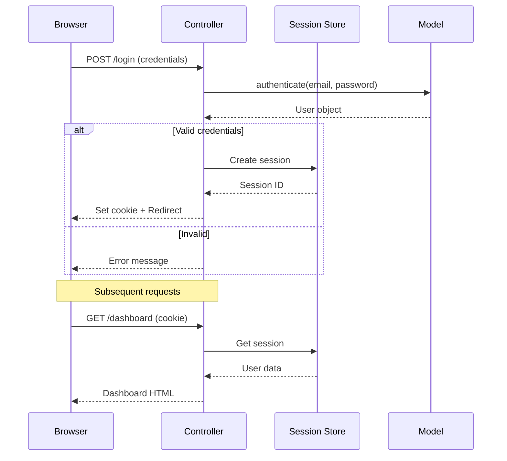

---

## Middleware/Filters

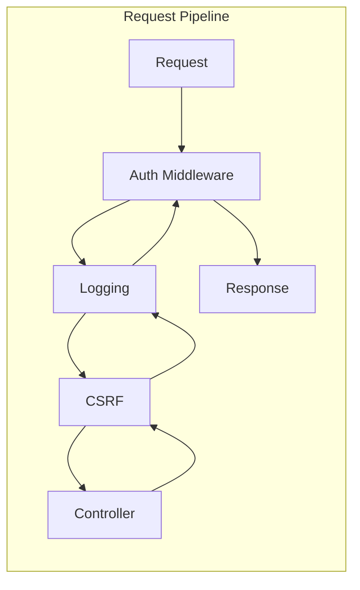

**Django Middleware:**
```python
class RequestLoggingMiddleware:
    def __init__(self, get_response):
        self.get_response = get_response

    def __call__(self, request):
        # Before view
        logger.info(f"{request.method} {request.path}")

        response = self.get_response(request)

        # After view
        logger.info(f"Response: {response.status_code}")

        return response
```

---

## Testing Strategy

### Test Types

| Layer | Test Type | Tools |
|-------|-----------|-------|
| Model | Unit tests | pytest, factory_boy |
| View | Template tests | Django test client |
| Controller | Integration tests | pytest-django |
| E2E | Browser tests | Selenium, Playwright |

### Example Tests

```python
# tests/test_models.py
def test_user_password_hashing():
    user = User(email="test@example.com")
    user.set_password("secret123")

    assert user.check_password("secret123")
    assert not user.check_password("wrong")

# tests/test_views.py
def test_user_list_view(client, user_factory):
    users = user_factory.create_batch(5)

    response = client.get('/users/')

    assert response.status_code == 200
    assert len(response.context['users']) == 5

# tests/test_forms.py
def test_user_form_validation():
    form = UserForm(data={
        'email': 'invalid-email',
        'name': 'Test'
    })

    assert not form.is_valid()
    assert 'email' in form.errors
```

---

## Checklist Implementazione

### Setup
- [ ] Framework installato e configurato
- [ ] Database configurato
- [ ] Template engine configurato
- [ ] Static files setup
- [ ] Session/Auth configurato

### Per Risorsa (CRUD)
- [ ] Model con validazioni
- [ ] Migration creata
- [ ] Controller con tutte le action
- [ ] Form per create/update
- [ ] Templates (index, show, form)
- [ ] Routes configurate
- [ ] Test per model, view, form

### Security
- [ ] CSRF protection
- [ ] SQL injection prevention (ORM)
- [ ] XSS prevention (escaping)
- [ ] Authentication
- [ ] Authorization (permissions)
- [ ] Password hashing

### Production
- [ ] Debug mode disabilitato
- [ ] Secret key sicura
- [ ] HTTPS enforced
- [ ] Static files served (CDN/nginx)
- [ ] Logging configurato
- [ ] Error pages custom

---

## Trade-offs

| Aspetto | Pro | Contro |
|---------|-----|--------|
| Semplicita' | Pattern ben conosciuto | Puo' diventare monolitico |
| Sviluppo | Rapido per CRUD | Meno adatto per SPA |
| Testing | Facile da testare | Integration test necessari |
| Team | Facile onboarding | Controller possono crescere |
| SEO | Server-side rendering | Meno interattivo |
| Performance | Caching facile | Full page reload |
