# Template: Architettura Serverless

## Overview

Architettura basata su funzioni stateless eseguite on-demand, con scaling automatico e modello pay-per-use. Ideale per workload variabili ed event-driven.

---

## Quando Usare

**Ideale per:**
- Carichi di lavoro variabili/imprevedibili
- Event-driven processing
- API con traffico burst
- Batch processing periodico
- MVP con budget limitato
- Integrazioni e automazioni

**Evitare se:**
- Latenza critica (cold start problematico)
- Processi long-running (>15 min)
- Stato persistente necessario in-memory
- Alto throughput costante (piu' costoso)
- Vendor lock-in inaccettabile

---

## Architettura di Riferimento

### C4 Context Diagram

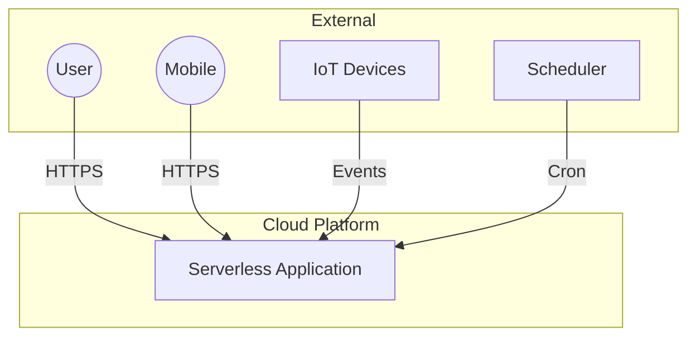

### C4 Container Diagram (AWS Example)

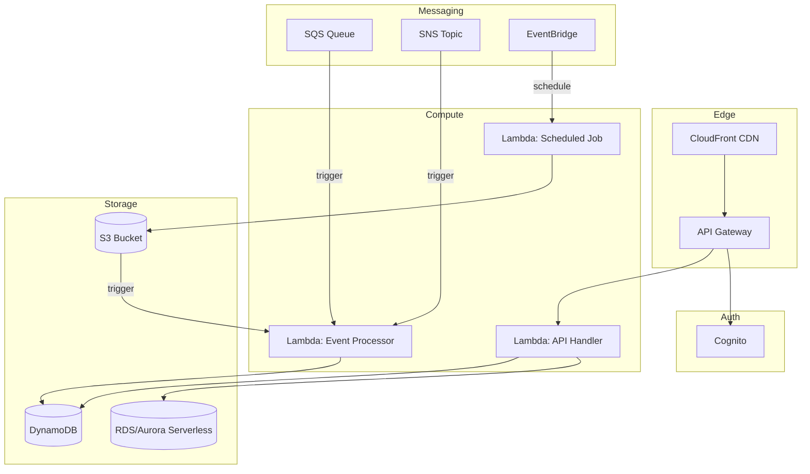

### Multi-Cloud View

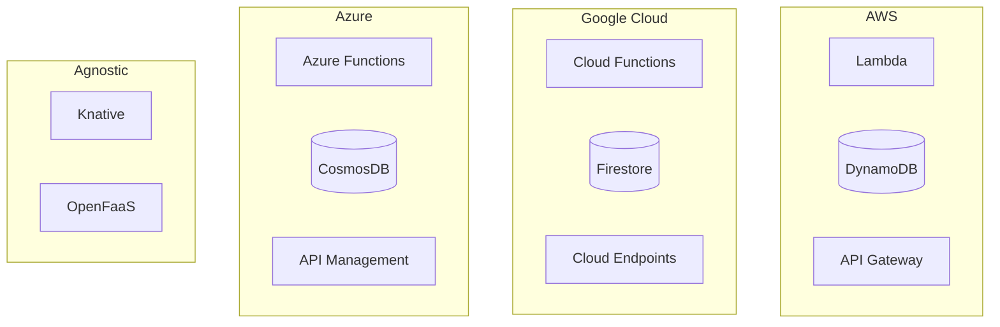

---

## Struttura Directory

### Single Function Project

```
project/
├── src/
│   ├── handlers/
│   │   ├── api/
│   │   │   ├── users.py
│   │   │   ├── products.py
│   │   │   └── orders.py
│   │   ├── events/
│   │   │   ├── s3_processor.py
│   │   │   ├── sqs_consumer.py
│   │   │   └── sns_handler.py
│   │   └── scheduled/
│   │       ├── daily_report.py
│   │       └── cleanup.py
│   │
│   ├── services/
│   │   ├── user_service.py
│   │   ├── notification_service.py
│   │   └── payment_service.py
│   │
│   ├── repositories/
│   │   ├── dynamodb/
│   │   │   └── user_repository.py
│   │   └── s3/
│   │       └── file_repository.py
│   │
│   ├── models/
│   │   ├── user.py
│   │   └── order.py
│   │
│   └── utils/
│       ├── logger.py
│       ├── validators.py
│       └── response.py
│
├── tests/
│   ├── unit/
│   ├── integration/
│   └── e2e/
│
├── infrastructure/
│   ├── serverless.yml          # Serverless Framework
│   ├── template.yaml           # SAM
│   └── terraform/
│       ├── main.tf
│       ├── lambda.tf
│       └── api_gateway.tf
│
├── scripts/
│   ├── deploy.sh
│   └── local.sh
│
├── requirements.txt
└── README.md
```

### Multi-Service Project

```
project/
├── services/
│   ├── api-service/
│   │   ├── src/
│   │   ├── serverless.yml
│   │   └── package.json
│   │
│   ├── processor-service/
│   │   ├── src/
│   │   ├── serverless.yml
│   │   └── package.json
│   │
│   └── notification-service/
│       ├── src/
│       ├── serverless.yml
│       └── package.json
│
├── shared/
│   ├── models/
│   ├── utils/
│   └── package.json
│
├── infrastructure/
│   ├── base/                    # VPC, IAM, shared resources
│   └── environments/
│       ├── dev/
│       ├── staging/
│       └── prod/
│
└── scripts/
    └── deploy-all.sh
```

---

## Pattern Chiave

### 1. API Gateway + Lambda

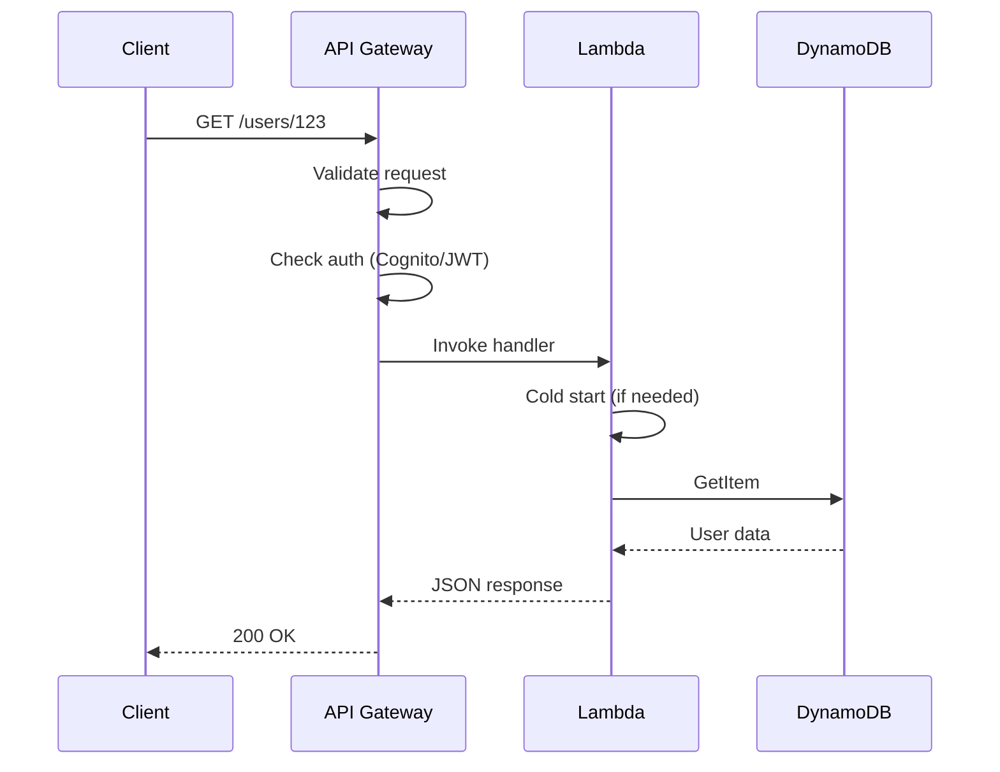

**Handler Example (Python):**
```python
import json
from services.user_service import UserService

def handler(event, context):
    """GET /users/{id}"""
    try:
        user_id = event['pathParameters']['id']
        user_service = UserService()
        user = user_service.get_by_id(user_id)

        if not user:
            return {
                'statusCode': 404,
                'body': json.dumps({'error': 'User not found'})
            }

        return {
            'statusCode': 200,
            'headers': {'Content-Type': 'application/json'},
            'body': json.dumps(user.to_dict())
        }

    except Exception as e:
        return {
            'statusCode': 500,
            'body': json.dumps({'error': str(e)})
        }
```

### 2. Event-Driven Processing

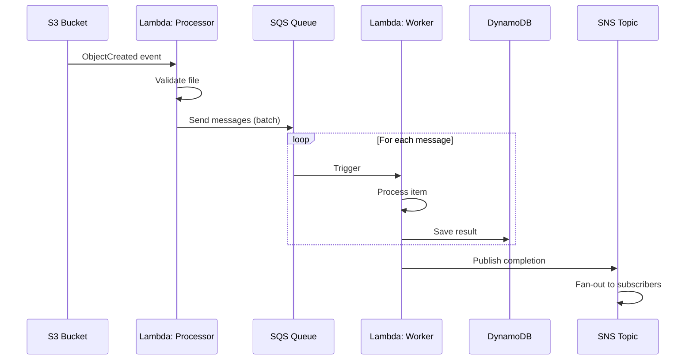

### 3. Saga Pattern (Distributed Transactions)

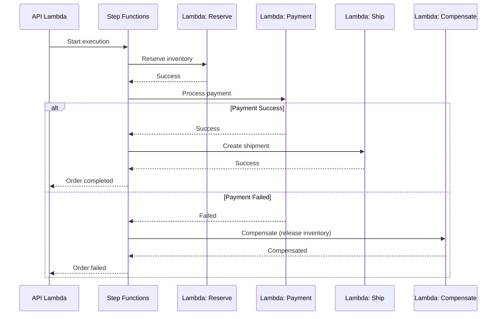

### 4. Fan-Out Pattern

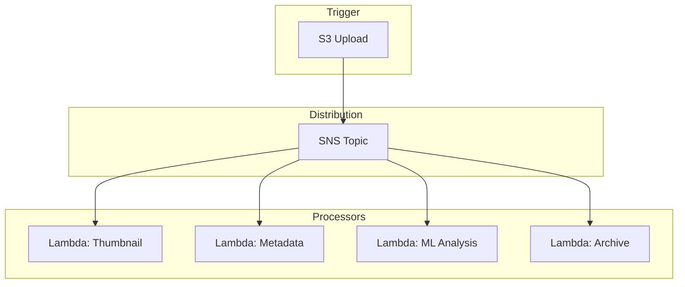

### 5. CQRS with Event Sourcing

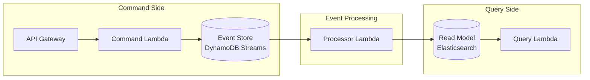

---

## Cold Start Mitigation

### Strategie

| Strategia | Descrizione | Trade-off |
|-----------|-------------|-----------|
| Provisioned Concurrency | Lambda pre-riscaldate | Costo fisso |
| Keep-warm | Ping periodico | Complessita' |
| Smaller packages | Bundle minimo | Manutenzione |
| Lazy loading | Import on-demand | Complessita' codice |
| SnapStart (Java) | Snapshot JVM | Solo Java |

### Provisioned Concurrency

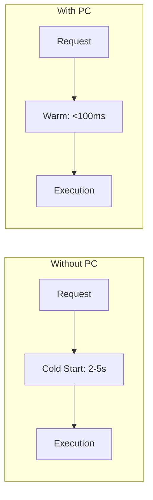

---

## Database Patterns

### DynamoDB Single Table Design

```mermaid
erDiagram
    SINGLE_TABLE {
        string PK "Partition Key"
        string SK "Sort Key"
        string GSI1PK "GSI1 Partition"
        string GSI1SK "GSI1 Sort"
        map data "Attributes"
    }
```

**Access Patterns:**
| Pattern | PK | SK |
|---------|----|----|
| Get user | USER#123 | PROFILE |
| Get user orders | USER#123 | ORDER#* |
| Get order | ORDER#456 | ORDER#456 |
| Get order items | ORDER#456 | ITEM#* |

### Aurora Serverless v2

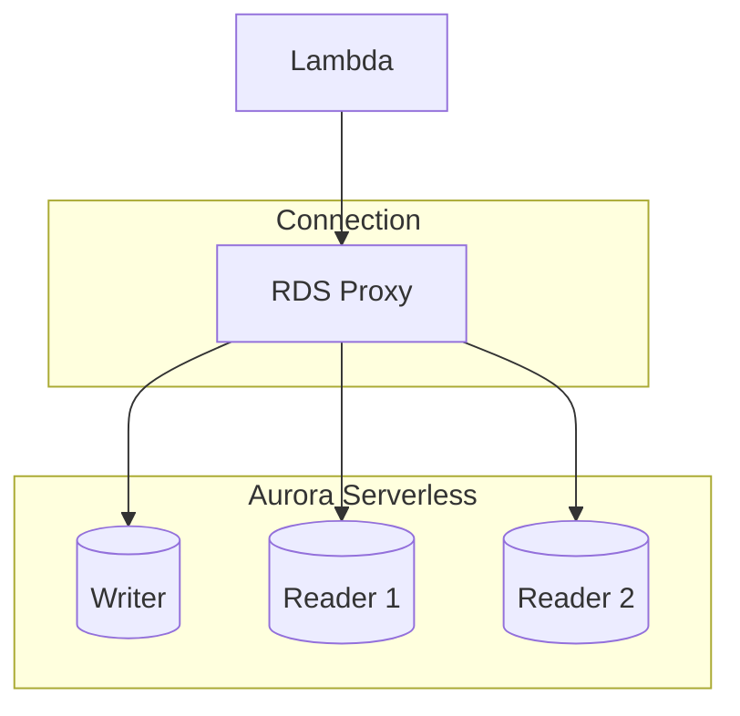

---

## Infrastructure as Code

### Serverless Framework

```yaml
# serverless.yml
service: my-service

provider:
  name: aws
  runtime: python3.11
  region: eu-west-1
  memorySize: 256
  timeout: 30
  environment:
    TABLE_NAME: ${self:custom.tableName}

custom:
  tableName: ${self:service}-${self:provider.stage}

functions:
  getUser:
    handler: src/handlers/api/users.get_handler
    events:
      - http:
          path: users/{id}
          method: get
          cors: true

  processUpload:
    handler: src/handlers/events/s3_processor.handler
    events:
      - s3:
          bucket: ${self:custom.uploadBucket}
          event: s3:ObjectCreated:*

  dailyReport:
    handler: src/handlers/scheduled/daily_report.handler
    events:
      - schedule: cron(0 8 * * ? *)

resources:
  Resources:
    UsersTable:
      Type: AWS::DynamoDB::Table
      Properties:
        TableName: ${self:custom.tableName}
        BillingMode: PAY_PER_REQUEST
        AttributeDefinitions:
          - AttributeName: PK
            AttributeType: S
          - AttributeName: SK
            AttributeType: S
        KeySchema:
          - AttributeName: PK
            KeyType: HASH
          - AttributeName: SK
            KeyType: RANGE
```

### AWS SAM

```yaml
# template.yaml
AWSTemplateFormatVersion: '2010-09-09'
Transform: AWS::Serverless-2016-10-31

Globals:
  Function:
    Timeout: 30
    Runtime: python3.11
    MemorySize: 256

Resources:
  GetUserFunction:
    Type: AWS::Serverless::Function
    Properties:
      CodeUri: src/
      Handler: handlers.api.users.get_handler
      Events:
        GetUser:
          Type: Api
          Properties:
            Path: /users/{id}
            Method: get
```

---

## Observability

### Distributed Tracing (X-Ray)

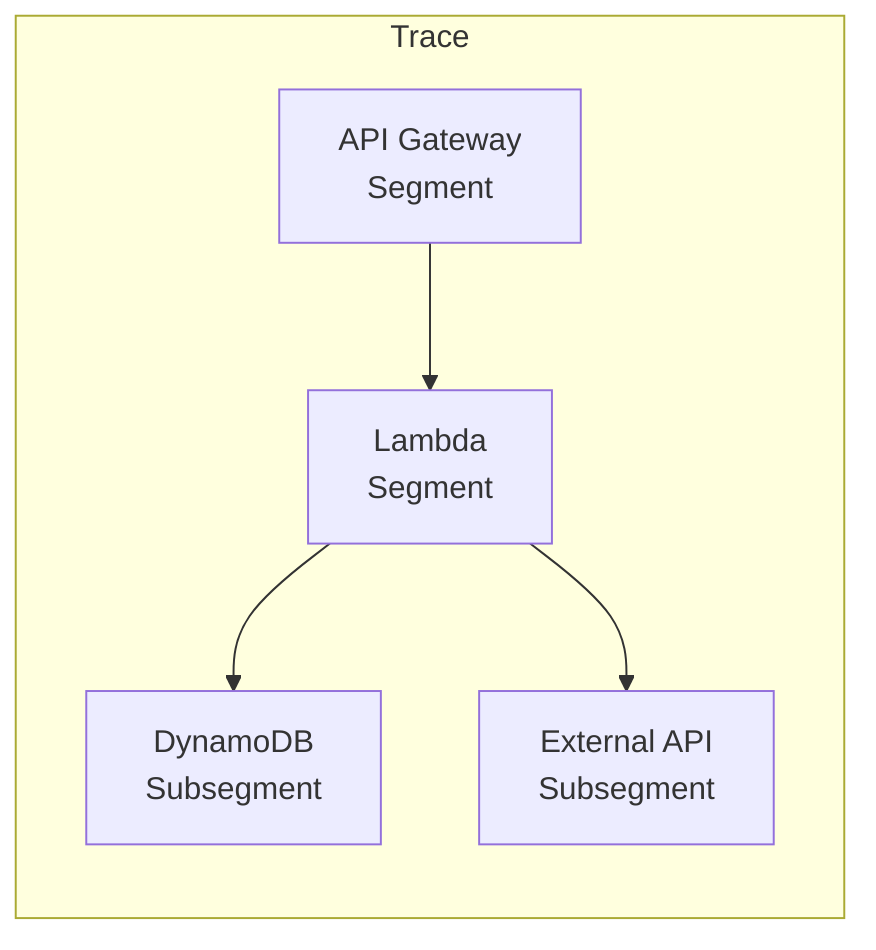

### CloudWatch Insights

```
# Query per errori
fields @timestamp, @message
| filter @message like /ERROR/
| sort @timestamp desc
| limit 100

# Query per cold starts
filter @type = "REPORT"
| stats avg(@duration), max(@duration), count(*) by bin(5m)
| filter @message like /Init Duration/
```

### Custom Metrics

```python
from aws_lambda_powertools import Metrics
from aws_lambda_powertools.metrics import MetricUnit

metrics = Metrics()

@metrics.log_metrics
def handler(event, context):
    metrics.add_metric(
        name="OrdersProcessed",
        unit=MetricUnit.Count,
        value=1
    )
    metrics.add_dimension("Environment", "prod")
```

---

## Security

### IAM Best Practices

```yaml
# Least privilege
Statement:
  - Effect: Allow
    Action:
      - dynamodb:GetItem
      - dynamodb:PutItem
    Resource:
      - !GetAtt UsersTable.Arn
```

### Secrets Management

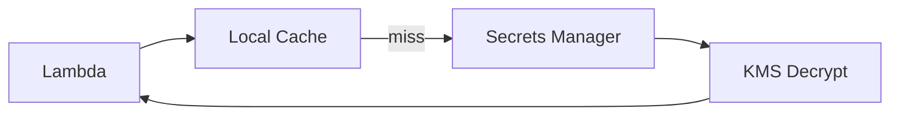

---

## Checklist Implementazione

### Setup
- [ ] Account cloud configurato
- [ ] IAM roles/policies
- [ ] VPC (se necessario)
- [ ] API Gateway configurato
- [ ] CI/CD pipeline

### Per Funzione
- [ ] Handler implementato
- [ ] Input validation
- [ ] Error handling
- [ ] Logging strutturato
- [ ] Timeout appropriato
- [ ] Memory sizing
- [ ] Cold start ottimizzato

### Database
- [ ] Schema progettato
- [ ] Access patterns definiti
- [ ] Indexes configurati
- [ ] Backup/restore

### Security
- [ ] IAM least privilege
- [ ] Secrets in Secrets Manager
- [ ] Encryption at rest/transit
- [ ] WAF (se API pubblica)

### Observability
- [ ] X-Ray tracing
- [ ] CloudWatch alarms
- [ ] Custom metrics
- [ ] Log retention policy

---

## Trade-offs

| Aspetto | Pro | Contro |
|---------|-----|--------|
| Costo | Pay-per-use, no idle cost | Puo' essere costoso ad alto volume |
| Scaling | Automatico, quasi infinito | Cold start latency |
| Ops | Zero server management | Debugging distribuito complesso |
| Vendor | Servizi managed integrati | Lock-in significativo |
| Dev | Focus su business logic | Nuovi pattern da imparare |
| Latency | Buona per carichi variabili | Cold start problematico |
